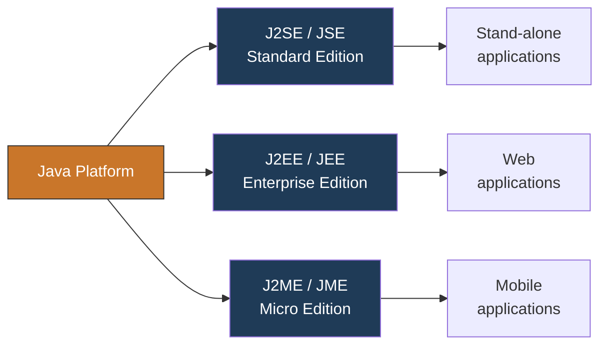
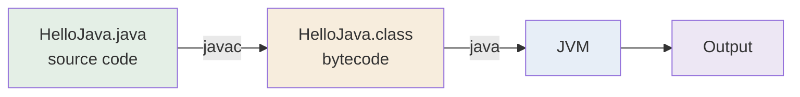

<div align="center">


  

</div>

---

> **In one line:** Java is a platform independent, object oriented programming language that runs anywhere a JVM exists.

## 1. What Is It?

Java is a general purpose, class based, **object oriented** programming language.

| Fact | Detail |
|---|---|
| Created by | James Gosling and his team, 1991, Sun Microsystems |
| Original name | **OAK** — renamed to **Java** in 1995 |
| Current owner | Oracle Corporation (acquired Sun in 2010) |
| Cost | Free and open source |
| Reach | Around 3 billion devices run Java |
| Slogan | **WORA** — Write Once, Run Anywhere |

## 2. Editions of Java



## 3. Why Do We Need It?

Other languages compile straight to machine code, so a program built on Windows will not run on Linux.
Java compiles to **bytecode** instead, and every platform simply ships its own JVM to run that bytecode.

## 4. What Can We Build With Java?

- Stand-alone (desktop) applications
- Web applications
- Mobile applications
- Games
- Servers
- Databases and much more

## 5. Simple Example

```java
public class HelloJava {
    public static void main(String[] args) {
        System.out.println("Welcome To Kundan Notes");
    }
}
```

## 6. How It Works



## 7. Important Rules

- One `public` class per `.java` file and the file name must match the class name.
- Execution always begins at `public static void main(String[] args)`.
- Java is **case sensitive** — `Main` and `main` are different.

## 8. Common Mistakes

- Saving the file with a name different from the public class name.
- Forgetting `static` on `main`, so the JVM cannot find an entry point.
- Confusing **Java** with **JavaScript** — two unrelated languages.

## 9. Best Practices

- Use meaningful, noun-style class names.
- Keep one responsibility per class while learning.
- Read compiler errors from the **first** error downwards.

## 10. In Depth

Java was designed for consumer electronics, where the same program had to run on television set-top boxes, remote controls and other devices that all used different processors. Compiling directly to machine code would have meant maintaining one build per device, so the team introduced an intermediate step: the compiler targets a **virtual** machine instead of a real one, and each real device supplies its own implementation of that virtual machine.

This single decision explains almost everything about the language:

- **Portability** comes from bytecode being a fixed instruction set that no physical CPU executes directly.
- **Security** comes from the JVM standing between the program and the operating system; bytecode is verified before it runs, so a corrupted or hostile class file is rejected rather than executed.
- **Automatic memory management** is possible because the JVM owns the heap and can decide when memory is no longer reachable.
- **Performance** is recovered by the JIT compiler, which watches which methods run often and compiles those into native code at runtime, so long-running Java programs approach the speed of compiled languages.

The trade-off is startup cost and memory overhead: a JVM has to be loaded and warmed up before the program reaches full speed, which is why Java is stronger for long-running server applications than for very short command line utilities.

## 11. Quick Revision

> Java = source code → bytecode (`javac`) → JVM execution.
> Platform independence comes from the **bytecode + JVM** combination, not from the OS.

---

<div align="center">

← <i>Start</i> &nbsp;•&nbsp; <a href="../README.md">Home</a> &nbsp;•&nbsp; <a href="02-Java-Features.md">Java Features →</a>


<sub>Core Java Theory Notes • Maintained by <b>Kundan</b></sub>

</div>
