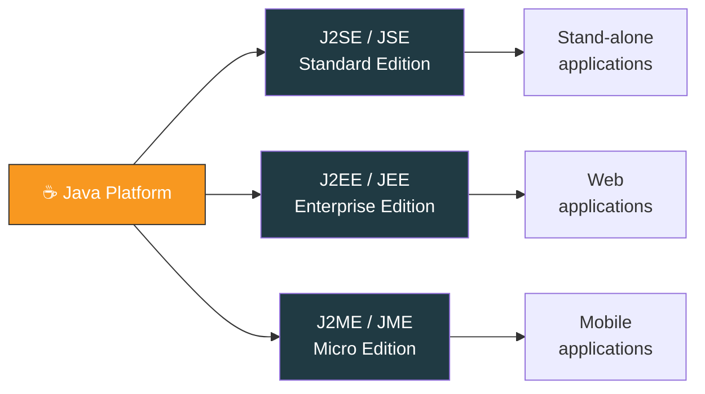
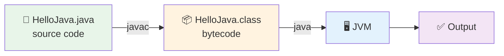

<div align="center">


  

</div>

---

> **In one line:** Java is a platform independent, object oriented programming language that runs anywhere a JVM exists.

## 🧠 1. What Is It?

Java is a general purpose, class based, **object oriented** programming language.

| Fact | Detail |
|---|---|
| Created by | James Gosling and his team, 1991, Sun Microsystems |
| Original name | **OAK** — renamed to **Java** in 1995 |
| Current owner | Oracle Corporation (acquired Sun in 2010) |
| Cost | Free and open source |
| Reach | Around 3 billion devices run Java |
| Slogan | **WORA** — Write Once, Run Anywhere |

## 🧩 2. Editions of Java



## ❓ 3. Why Do We Need It?

Other languages compile straight to machine code, so a program built on Windows will not run on Linux.
Java compiles to **bytecode** instead, and every platform simply ships its own JVM to run that bytecode.

## 🛠️ 4. What Can We Build With Java?

- Stand-alone (desktop) applications
- Web applications
- Mobile applications
- Games
- Servers
- Databases and much more

## 🧪 5. Simple Example

```java
public class HelloJava {
    public static void main(String[] args) {
        System.out.println("Welcome To Kundan Notes");
    }
}
```

## ⚙️ 6. How It Works



## 📌 7. Important Rules

- One `public` class per `.java` file and the file name must match the class name.
- Execution always begins at `public static void main(String[] args)`.
- Java is **case sensitive** — `Main` and `main` are different.

## ⚠️ 8. Common Mistakes

- Saving the file with a name different from the public class name.
- Forgetting `static` on `main`, so the JVM cannot find an entry point.
- Confusing **Java** with **JavaScript** — two unrelated languages.

## ✅ 9. Best Practices

- Use meaningful, noun-style class names.
- Keep one responsibility per class while learning.
- Read compiler errors from the **first** error downwards.

## 🔁 10. Quick Revision

> Java = source code ➜ bytecode (`javac`) ➜ JVM execution.
> Platform independence comes from the **bytecode + JVM** combination, not from the OS.

---

<div align="center">

⬅️ <i>Start</i> &nbsp;•&nbsp; <a href="../README.md">🏠 Home</a> &nbsp;•&nbsp; <a href="02-Java-Features.md">Java Features ➡️</a>


<sub>📘 Core Java Theory Notes • Maintained by <b>Kundan</b></sub>

</div>
