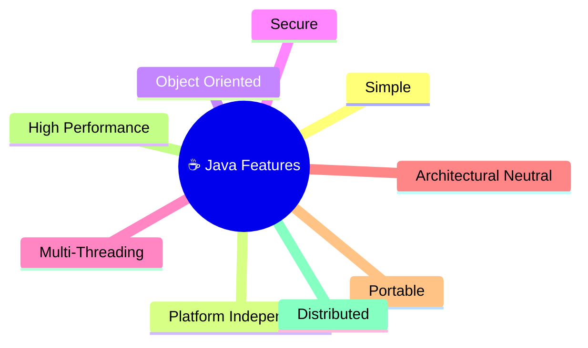
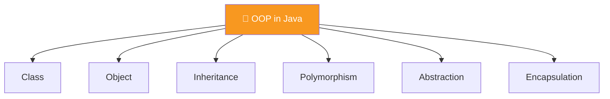

<div align="center">


  

</div>

---

> **In one line:** The eight headline features that made Java the default language for portable, safe, multi-threaded software.

## 🧠 1. What Is It?

Features are the built-in strengths of the language that explain *why* Java is chosen for large systems.

## 🧩 2. Feature Map



## 📋 3. Feature By Feature

| # | Feature | Meaning |
|---|---|---|
| 1 | **Simple** | Clean syntax; confusing C++ ideas like pointers and operator overloading were removed |
| 2 | **Platform Independent** | Compiles to bytecode, which runs on any machine that has a JRE |
| 3 | **Object Oriented** | Software is organised as objects that carry both data and behaviour |
| 4 | **Secure** | Code runs inside the JVM with almost no direct interaction with the OS |
| 5 | **Multi-Threading** | Many tasks run at the same time while sharing the same memory |
| 6 | **Architectural Neutral** | Bytecode is tied to no particular CPU architecture |
| 7 | **Portable** | Primitive type sizes are fixed, so behaviour never changes across machines |
| 8 | **High Performance** | The JIT compiler converts hot bytecode into native machine code |
| 9 | **Distributed** | Built-in libraries for TCP/IP make networked programs easy |

## 🧱 4. Object Oriented Pillars



## 🧪 5. Simple Example

```java
// Platform independence in action: the same .class file runs on Windows, Linux and macOS
public class Portable {
    public static void main(String[] args) {
        System.out.println("Same bytecode, any machine");
    }
}
```

## ⚠️ 6. Common Mistakes

- Saying Java is "fully interpreted" — it is compiled to bytecode **and** JIT compiled.
- Assuming "platform independent" means the JVM itself is universal; the JVM is platform **specific**.

## 🔁 7. Quick Revision

> **Simple, Platform Independent, Object Oriented, Secure, Multi-Threaded, Architectural Neutral, Portable, High Performance, Distributed.**
> Everything traces back to one slogan: **WORA**.

---

<div align="center">

<a href="01-Java-Introduction.md">⬅️ Java Introduction</a> &nbsp;•&nbsp; <a href="../README.md">🏠 Home</a> &nbsp;•&nbsp; <a href="03-Java-Installation.md">Java Installation ➡️</a>


<sub>📘 Core Java Theory Notes • Maintained by <b>Kundan</b></sub>

</div>
