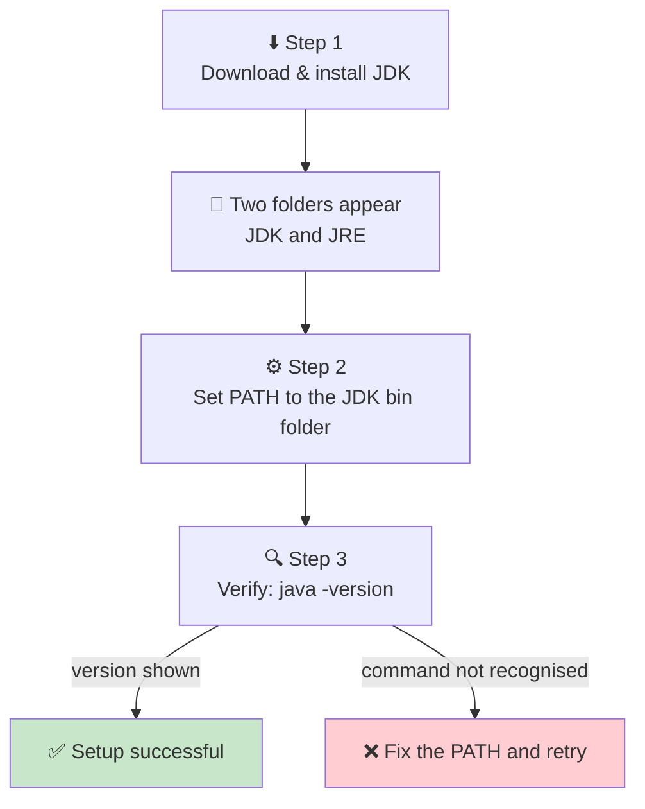
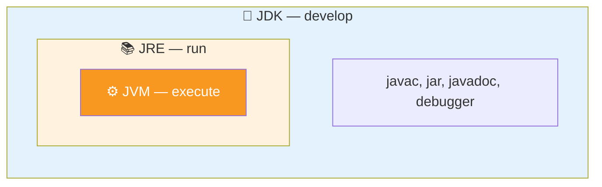

<div align="center">


  

</div>

---

> **In one line:** Install the JDK, set the PATH to the bin folder, then verify with java -version.

## 🧠 1. What Is It?

Environment setup means installing Java software and telling the operating system where its tools live.

## 🧩 2. Setup Flow



## ⚙️ 3. Step By Step

**Step 1 — Install**
Download the JDK and run the installer. After installation you will see a **JDK** folder and a **JRE** folder.

**Step 2 — Set PATH (Windows)**
`Environment Variables ➜ System Variables ➜ Edit Path ➜ add the JDK bin directory`

```
Path = C:\Program Files\Java\jdk-21\bin
```

**Step 3 — Verify**

```bash
java -version
javac -version
```

## 🧱 4. JDK vs JRE vs JVM



| Term | Responsibility |
|---|---|
| **JDK** | Set of tools used to **develop** Java programs |
| **JRE** | Provides the platform required to **run** Java programs |
| **JVM** | Handles **execution**, memory allocation and de-allocation |

## ⚠️ 5. Common Mistakes

- Pointing PATH at the JDK folder instead of the **bin** folder inside it.
- Forgetting to reopen the command prompt after editing PATH.
- Installing only a JRE and then wondering why `javac` is missing.

## ✅ 6. Best Practices

- Keep one primary JDK version per machine while learning.
- Verify both `java` and `javac` — the second one proves the JDK, not just the JRE, is on PATH.

## 🔁 7. Quick Revision

> Install JDK ➜ set PATH to `...\jdk\bin` ➜ verify with `java -version`.
> **JDK ⊃ JRE ⊃ JVM.**

---

<div align="center">

<a href="02-Java-Features.md">⬅️ Java Features</a> &nbsp;•&nbsp; <a href="../README.md">🏠 Home</a> &nbsp;•&nbsp; <a href="04-Program-Execution-Flow.md">Program Execution Flow ➡️</a>


<sub>📘 Core Java Theory Notes • Maintained by <b>Kundan</b></sub>

</div>
