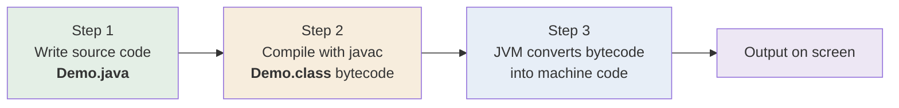

<div align="center">


  

</div>

---

> **In one line:** Write .java, compile it into .class bytecode, then let the JVM turn bytecode into machine code.

## 1. What Is It?

The three-step journey every Java program takes from typed text to a running process.

## 2. Execution Flow Diagram



## 3. How It Works

| Step | Command | Input | Output |
|---|---|---|---|
| Write | any editor / IDE | your logic | `Demo.java` |
| Compile | `javac Demo.java` | source code | `Demo.class` (bytecode) |
| Execute | `java Demo` | bytecode | machine code → result |

## 4. Simple Example

```java
public class Demo {
    public static void main(String[] args) {
        System.out.println("Execution flow demo");
    }
}
```

```bash
javac Demo.java   # produces Demo.class
java Demo         # prints: Execution flow demo
```

## 5. Important Rules

- Compilation needs the **file name** with extension; execution needs the **class name** without extension.
- A `.class` file is produced for every class in the source file.
- If compilation fails, no `.class` file is created, so execution cannot even start.

## 6. Common Mistakes

- Running `java Demo.java`-style commands with the old workflow habits, or `java Demo.class`.
- Expecting the `.class` file to contain machine code — it contains bytecode.

## 7. In Depth

The three steps correspond to three different kinds of failure, and recognising which step failed is the fastest way to debug.

| Failure at | Symptom | Typical cause |
|---|---|---|
| Writing | Nothing compiles at all | Wrong file name, file saved as `.txt` |
| Compilation | Compile-time error, no `.class` file produced | Syntax, type or naming mistake |
| Execution | Runtime exception or wrong output | Logic mistake, missing input, null reference | Compilation is **ahead of time** and happens once; execution is **just in time** and happens on every run. That split is why a single `.class` file can be copied to any machine, and also why the JVM can optimise the same bytecode differently on a laptop and on a server, based on how the program actually behaves while running.

Since Java 11 a single source file can also be launched directly with `java Demo.java`. This compiles the file in memory and runs it immediately, without writing a `.class` file to disk. It is convenient for small scripts, but real projects still compile first because they involve many classes and external libraries.

## 8. Quick Revision

> `.java` --javac--> `.class` --JVM--> machine code --> output.

---

<div align="center">

<a href="03-Java-Installation.md">← Java Installation</a> &nbsp;•&nbsp; <a href="../README.md">Home</a> &nbsp;•&nbsp; <a href="05-Java-Programming-Elements.md">Java Programming Elements →</a>


<sub>Core Java Theory Notes • Maintained by <b>Kundan</b></sub>

</div>
