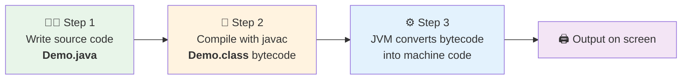

<div align="center">


  

</div>

---

> **In one line:** Write .java, compile it into .class bytecode, then let the JVM turn bytecode into machine code.

## 🧠 1. What Is It?

The three-step journey every Java program takes from typed text to a running process.

## 🧩 2. Execution Flow Diagram



## ⚙️ 3. How It Works

| Step | Command | Input | Output |
|---|---|---|---|
| Write | any editor / IDE | your logic | `Demo.java` |
| Compile | `javac Demo.java` | source code | `Demo.class` (bytecode) |
| Execute | `java Demo` | bytecode | machine code ➜ result |

## 🧪 4. Simple Example

```java
public class Demo {
    public static void main(String[] args) {
        System.out.println("Execution flow demo");
    }
}
```

```bash
javac Demo.java   # produces Demo.class
java Demo         # prints: Execution flow demo
```

## 📌 5. Important Rules

- Compilation needs the **file name** with extension; execution needs the **class name** without extension.
- A `.class` file is produced for every class in the source file.
- If compilation fails, no `.class` file is created, so execution cannot even start.

## ⚠️ 6. Common Mistakes

- Running `java Demo.java`-style commands with the old workflow habits, or `java Demo.class`.
- Expecting the `.class` file to contain machine code — it contains bytecode.

## 🔁 7. Quick Revision

> `.java` --javac--> `.class` --JVM--> machine code --> output.

---

<div align="center">

<a href="03-Java-Installation.md">⬅️ Java Installation</a> &nbsp;•&nbsp; <a href="../README.md">🏠 Home</a> &nbsp;•&nbsp; <a href="05-Java-Programming-Elements.md">Java Programming Elements ➡️</a>


<sub>📘 Core Java Theory Notes • Maintained by <b>Kundan</b></sub>

</div>
