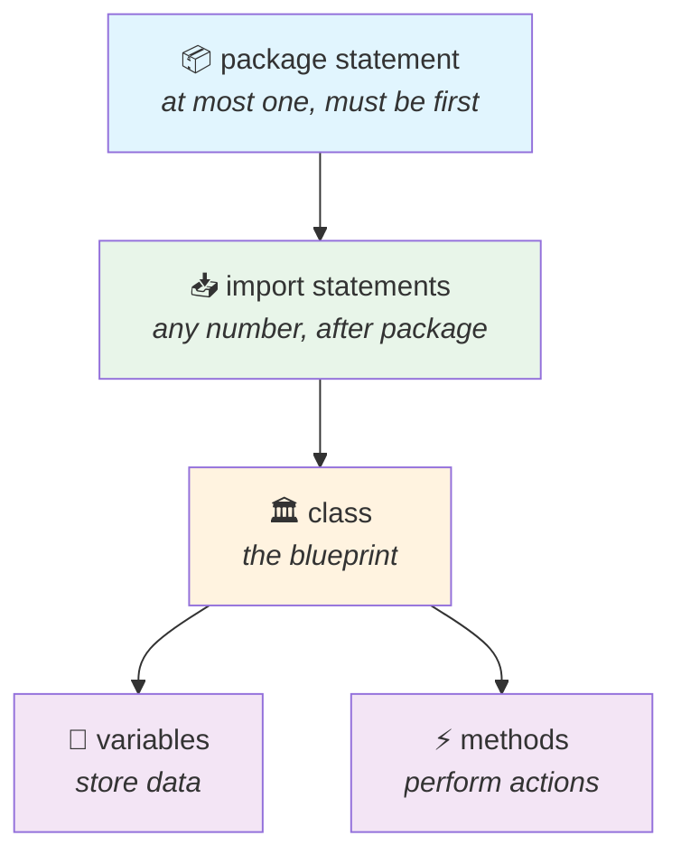

<div align="center">


  

</div>

---

> **In one line:** A Java file is built from package, import, class, variables and methods — in that order.

## 🧠 1. What Is It?

The fixed set of building blocks that appear inside a `.java` file.

## 🧩 2. Structure Diagram



## 📋 3. Element By Element

| Element | Purpose | Rule |
|---|---|---|
| **package** | Groups related classes | Only one, and it must be the first statement |
| **import** | Brings another program's types into this file | Many allowed, always after `package` |
| **class** | The plan that defines program elements | The most important part of the file |
| **variables** | Store data | Any number inside a class |
| **methods** | Hold the business logic | Any number inside a class |

## 🧪 4. Simple Example

```java
package com.kundan.basics;   // 1. package

import java.util.Scanner;    // 2. import

public class Student {       // 3. class
    String name;             // 4. variable

    void display() {         // 5. method
        System.out.println(name);
    }
}
```

## 📌 5. Important Rules

- Order is fixed: **package ➜ import ➜ class**.
- A class may contain zero or many variables and methods.
- Business logic belongs inside methods, never loose inside the class body.

## ⚠️ 6. Common Mistakes

- Writing `import` above `package`.
- Writing more than one `package` statement.

## 🔁 7. Quick Revision

> **package (one) ➜ import (many) ➜ class ➜ { variables + methods }**

---

<div align="center">

<a href="04-Program-Execution-Flow.md">⬅️ Program Execution Flow</a> &nbsp;•&nbsp; <a href="../README.md">🏠 Home</a> &nbsp;•&nbsp; <a href="06-Java-Program-Development.md">Java Program Development ➡️</a>


<sub>📘 Core Java Theory Notes • Maintained by <b>Kundan</b></sub>

</div>
