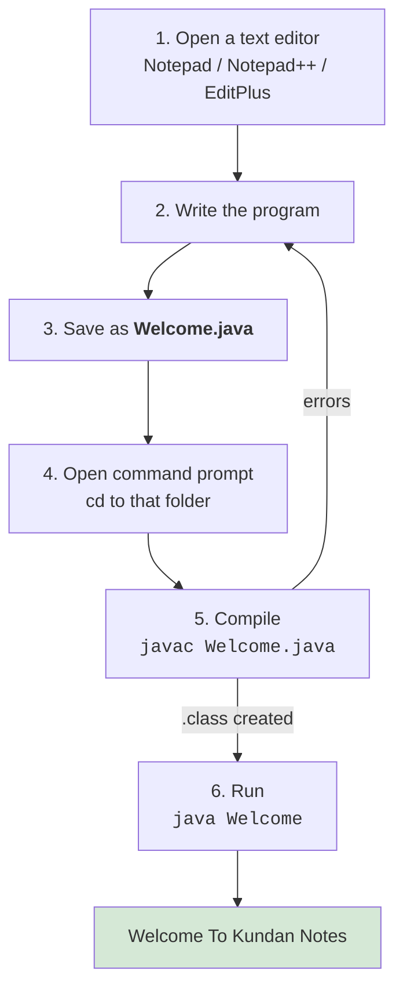

<div align="center">


  

</div>

---

> **In one line:** The six practical steps from opening an editor to seeing your first output.

## 1. What Is It?

The hands-on routine for building and running a program without any IDE.

## 2. Development Flow



## 3. Simple Example

```java
public class Welcome {
    public static void main(String[] args) {
        System.out.println("Welcome To Kundan Notes");
    }
}
```

```bash
javac Welcome.java
java Welcome
```

## 4. Important Rules

- File name **must** be `Welcome.java` because `Welcome` is public.
- Compile with the extension, run without it.
- Seeing `Welcome.class` in the folder is proof that compilation succeeded.

## 5. Common Mistakes

- Saving the file as `Welcome.java.txt` from Notepad.
- Running `java` from a different directory than the `.class` file.

## 6. Best Practices

- Learn the command line version first, then move to an IDE.
- In real projects an IDE (Eclipse, IntelliJ IDEA, VS Code) handles these steps for you.

## 7. In Depth

Learning the manual `javac` and `java` cycle matters even though real projects use an IDE, because the IDE performs exactly these steps behind a button. When a build fails in an IDE or on a build server, the error messages are the ones produced by these two tools.

A realistic project adds three things on top of this cycle:

- **A source folder layout** that mirrors the package structure, for example `src/com/kundan/app/Demo.java`.
- **A separate output folder** so compiled classes do not sit next to source files, typically `javac -d bin src/...`.
- **A build tool** such as Maven or Gradle that manages dependencies, compiles all sources, runs tests and packages the result into a JAR file.

A **JAR** is simply a ZIP archive of `.class` files with a manifest naming the main class, which allows a whole application to be distributed as one file and started with `java -jar app.jar`.

## 8. Quick Revision

> Write → save as `ClassName.java` → `javac ClassName.java` → `java ClassName`.

---

<div align="center">

<a href="05-Java-Programming-Elements.md">← Java Programming Elements</a> &nbsp;•&nbsp; <a href="../README.md">Home</a> &nbsp;•&nbsp; <a href="07-Compilation.md">Compilation →</a>


<sub>Core Java Theory Notes • Maintained by <b>Kundan</b></sub>

</div>
