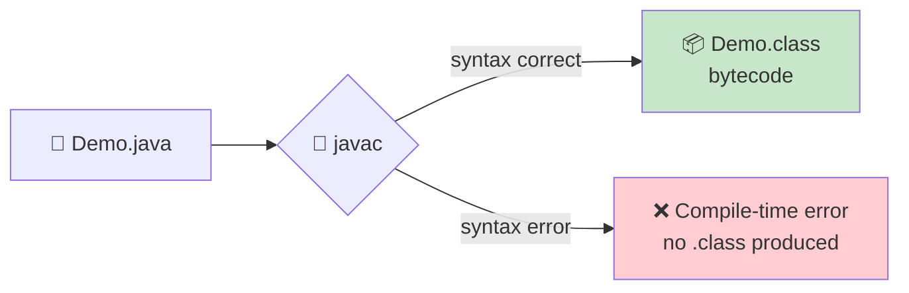

<div align="center">


  

</div>

---

> **In one line:** javac checks syntax and converts source code into platform independent bytecode.

## 🧠 1. What Is It?

Compilation is the step where the **java compiler (`javac`)** converts human readable source code into bytecode.

## 🧩 2. Compilation Diagram



## ⚙️ 3. How It Works

1. `javac` reads the `.java` file.
2. It checks syntax, types and naming rules.
3. If everything is valid it writes one `.class` file per class.
4. That bytecode is **platform independent** — it belongs to no CPU.

## 🧪 4. Simple Example

```bash
javac Demo.java
```

```java
public class Demo {
    public static void main(String[] args) {
        System.out.println("Compiled successfully");
    }
}
```

## 📌 5. Important Rules

- `javac` needs the full file name with the `.java` extension.
- Errors reported at this stage are called **compile-time errors**.
- No `.class` file means the program never reaches the JVM.

## ⚠️ 6. Common Mistakes

- Missing semicolons, unmatched braces, or a misspelled class name.
- Assuming a compiled program is correct — compilation checks **syntax**, not **logic**.

## 🔁 7. Quick Revision

> `javac FileName.java` ➜ bytecode `.class`. Compile-time errors live here.

---

<div align="center">

<a href="06-Java-Program-Development.md">⬅️ Java Program Development</a> &nbsp;•&nbsp; <a href="../README.md">🏠 Home</a> &nbsp;•&nbsp; <a href="08-Execution.md">Execution ➡️</a>


<sub>📘 Core Java Theory Notes • Maintained by <b>Kundan</b></sub>

</div>
