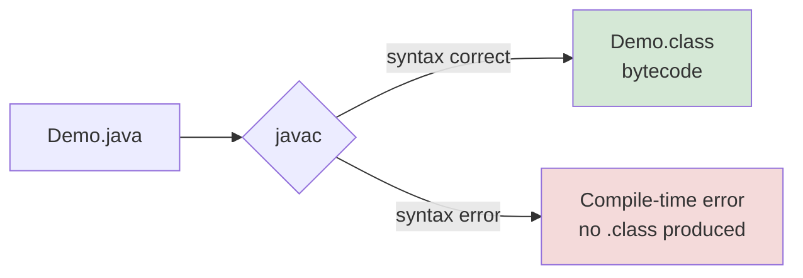

<div align="center">


  

</div>

---

> **In one line:** javac checks syntax and converts source code into platform independent bytecode.

## 1. What Is It?

Compilation is the step where the **java compiler (`javac`)** converts human readable source code into bytecode.

## 2. Compilation Diagram



## 3. How It Works

1. `javac` reads the `.java` file.
2. It checks syntax, types and naming rules.
3. If everything is valid it writes one `.class` file per class.
4. That bytecode is **platform independent** — it belongs to no CPU.

## 4. Simple Example

```bash
javac Demo.java
```

```java
public class Demo {
    public static void main(String[] args) {
        System.out.println("Compiled successfully");
    }
}
```

## 5. Important Rules

- `javac` needs the full file name with the `.java` extension.
- Errors reported at this stage are called **compile-time errors**.
- No `.class` file means the program never reaches the JVM.

## 6. Common Mistakes

- Missing semicolons, unmatched braces, or a misspelled class name.
- Assuming a compiled program is correct — compilation checks **syntax**, not **logic**.

## 7. In Depth

Compilation is not a single operation. `javac` runs a sequence of phases, and knowing them explains the error messages it produces.

1. **Lexical analysis** breaks the text into tokens such as keywords, identifiers and operators. Bad characters are caught here.
2. **Syntax analysis** builds a parse tree and reports missing semicolons or unbalanced braces.
3. **Semantic analysis** checks meaning: whether a variable was declared, whether types match, whether a method exists with the given arguments.
4. **Bytecode generation** writes the `.class` file.

The `.class` file contains far more than instructions. It holds the **constant pool** (all literals and symbolic references used by the class), field and method descriptors, and the bytecode of each method. Because these symbolic references are resolved later by the JVM, classes can be compiled separately and linked only at runtime, which is why replacing one `.class` file in a large application does not require recompiling everything.

Compilation checks **syntax and types only**. A program that divides by zero, reads past the end of an array or dereferences a null value compiles perfectly; those are runtime concerns.

## 8. Quick Revision

> `javac FileName.java` → bytecode `.class`. Compile-time errors live here.

---

<div align="center">

<a href="06-Java-Program-Development.md">← Java Program Development</a> &nbsp;•&nbsp; <a href="../README.md">Home</a> &nbsp;•&nbsp; <a href="08-Execution.md">Execution →</a>


<sub>Core Java Theory Notes • Maintained by <b>Kundan</b></sub>

</div>
