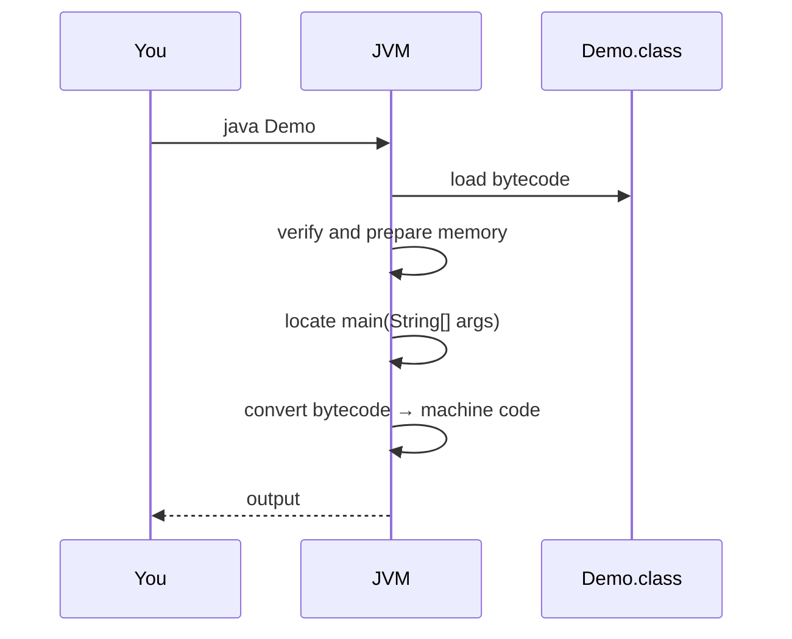

<div align="center">


  

</div>

---

> **In one line:** java ClassName starts a JVM, loads the bytecode and runs main.

## 1. What Is It?

Execution is the step where the **JVM** loads the `.class` file, converts bytecode into machine code and produces the result.

## 2. Execution Diagram



## 3. How It Works

- `java Demo` starts a fresh JVM process.
- The class loader brings `Demo.class` into memory.
- The execution engine (Interpreter + JIT) runs the instructions.
- The JVM allocates memory at the start and de-allocates it when objects are no longer used.

## 4. Simple Example

```bash
java Demo
```

## 5. Important Rules

- Use the **class name only**, with no `.class` extension.
- `main` must be `public static void main(String[] args)` or the JVM cannot start.
- Errors that appear here are **runtime errors**, not compile-time errors.

## 6. Common Mistakes

- Typing `java Demo.class`.
- Case mismatch — `java demo` will not find `Demo.class`.

## 7. In Depth

Execution begins long before the first line of `main` runs. The JVM performs three preparatory stages for every class it touches:

- **Loading** — the class loader reads the `.class` bytes and creates a `Class` object in the Method Area.
- **Linking** — verification checks that the bytecode is well formed and cannot corrupt memory, preparation allocates static fields with default values, and resolution turns symbolic references into direct ones.
- **Initialization** — static variables receive their real values and static blocks run, in the order they appear in the source.

Only then does the JVM invoke `main`. Note that initialization is **lazy**: a class is initialized the first time it is actively used, not when the program starts, which is why a static block in an unused class never runs.

The execution engine begins by **interpreting** bytecode, which starts quickly but runs slowly. A profiling counter tracks how often each method and loop executes, and once a threshold is crossed the **JIT compiler** compiles that code to native instructions and applies optimisations such as inlining and dead-code elimination. This is why a benchmark's first iteration is always far slower than its hundredth.

## 8. Quick Revision

> `java ClassName` → JVM loads bytecode → runs `main` → output.

---

<div align="center">

<a href="07-Compilation.md">← Compilation</a> &nbsp;•&nbsp; <a href="../README.md">Home</a> &nbsp;•&nbsp; <a href="09-Translators.md">Translators →</a>


<sub>Core Java Theory Notes • Maintained by <b>Kundan</b></sub>

</div>
