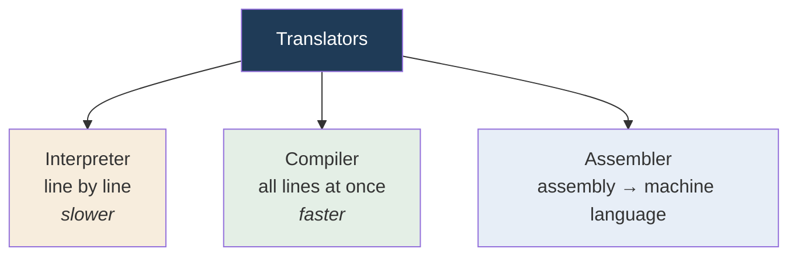
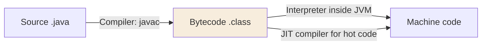

  

---

> **In one line:** Interpreter, compiler and assembler each convert code from one format to another.

## 1. What Is It?

A translator converts a program from one format into another format.

## 2. Types Of Translators

## 3. Comparison

| | Interpreter | Compiler | Assembler |
|---|---|---|---|
| Converts | One line at a time | The whole program at once | Assembly language |
| Speed | Slow | Fast | — |
| Error reporting | Stops at the first bad line | Reports all errors together | — |
| Output | No separate file | Separate output file | Machine language |

## 4. Where Java Uses Both

Java is **compiled and interpreted** — `javac` compiles, and the JVM interprets while the JIT compiles the frequently used parts.

## 5. Common Mistakes

- Calling Java "purely compiled" or "purely interpreted"; it is a hybrid.
- Mixing up the JIT (bytecode → native) with `javac` (source → bytecode).

## 6. In Depth

The compiler-versus-interpreter distinction is about **when** translation happens, not about which is better.

A compiler translates the entire program before execution, so translation cost is paid once and the running program is fast, but any change requires recompiling. An interpreter translates and executes one statement at a time, so a change takes effect immediately and errors are reported the moment the bad line is reached, but the same line inside a loop is retranslated on every pass.

Java deliberately takes both. `javac` performs **ahead-of-time** compilation to bytecode, which catches type errors early and produces a compact portable artifact. The JVM then interprets that bytecode, and the **JIT** performs **just-in-time** compilation of the parts that run frequently.

The advantage of JIT over ahead-of-time compilation is information: the JIT knows the actual processor, the real data and which branches are actually taken, so it can optimise for the observed behaviour and de-optimise if that behaviour later changes. An assembler occupies a different level entirely — it maps assembly mnemonics one-to-one onto machine instructions and performs no analysis.

## 7. Quick Revision

> Interpreter = line by line. Compiler = whole program. Assembler = assembly → machine.
> Java uses a **compiler + interpreter + JIT** model.

---

<a href="08-Execution.md">← Execution</a> &nbsp;•&nbsp; <a href="../README.md">Home</a> &nbsp;•&nbsp; <a href="10-JVM-Architecture.md">JVM Architecture →</a>

Core Java Theory Notes • Maintained by <b>Kundan</b>

