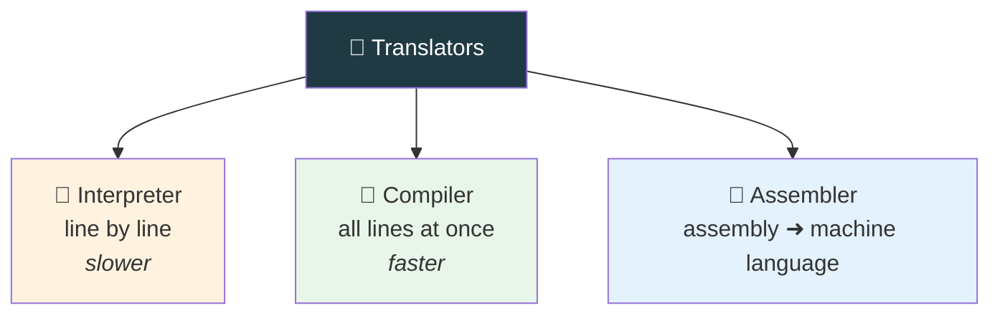
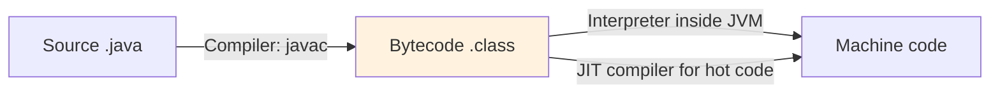

  

---

> **In one line:** Interpreter, compiler and assembler each convert code from one format to another.

## 🧠 1. What Is It?

A translator converts a program from one format into another format.

## 🧩 2. Types Of Translators

## 📋 3. Comparison

| | Interpreter | Compiler | Assembler |
|---|---|---|---|
| Converts | One line at a time | The whole program at once | Assembly language |
| Speed | Slow | Fast | — |
| Error reporting | Stops at the first bad line | Reports all errors together | — |
| Output | No separate file | Separate output file | Machine language |

## ⚙️ 4. Where Java Uses Both

Java is **compiled and interpreted** — `javac` compiles, and the JVM interprets while the JIT compiles the frequently used parts.

## ⚠️ 5. Common Mistakes

- Calling Java "purely compiled" or "purely interpreted"; it is a hybrid.
- Mixing up the JIT (bytecode ➜ native) with `javac` (source ➜ bytecode).

## 🔁 6. Quick Revision

> Interpreter = line by line. Compiler = whole program. Assembler = assembly ➜ machine.
> Java uses a **compiler + interpreter + JIT** model.

---

<a href="08-Execution.md">⬅️ Execution</a> &nbsp;•&nbsp; <a href="../README.md">🏠 Home</a> &nbsp;•&nbsp; <a href="10-JVM-Architecture.md">JVM Architecture ➡️</a>

📘 Core Java Theory Notes • Maintained by <b>Kundan</b>

