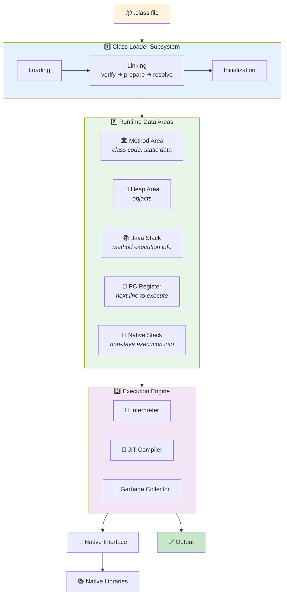
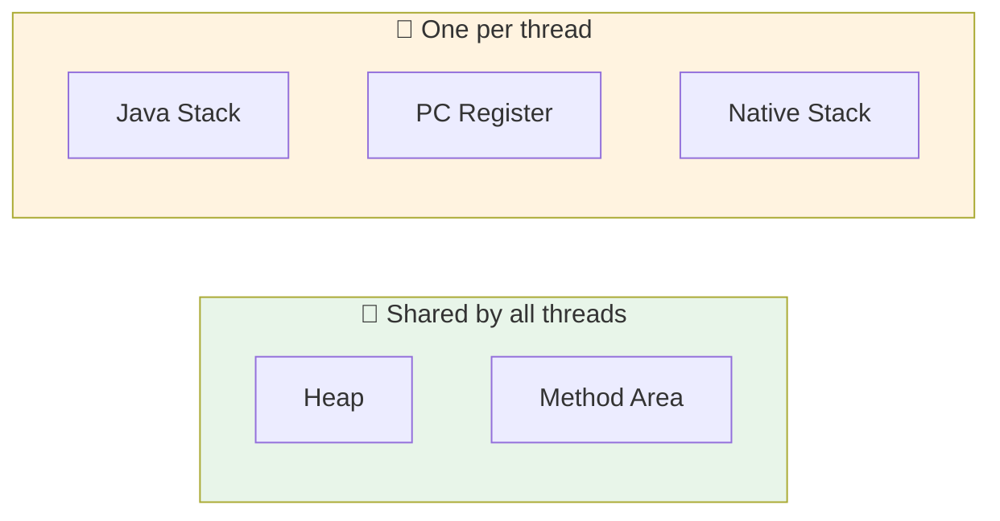

<div align="center">


  

</div>

---

> **In one line:** The JVM is Class Loader + Runtime Data Areas + Execution Engine, plus the native bridge.

## 🧠 1. What Is It?

**JVM** stands for **Java Virtual Machine**. It is part of the JRE, it cannot be seen with our eyes, and it is responsible for running Java programs, converting bytecode into a machine understandable format, and allocating and releasing memory.

## 🧩 2. JVM Architecture Diagram



## 📋 3. Component Responsibilities

| Component | Responsibility |
|---|---|
| **Class Loader** | Loads the `.class` file into the JVM |
| **Method Area** | Stores class level code, metadata and static data |
| **Heap Area** | Stores all objects |
| **Java Stack** | Stores method execution information (frames, local variables) |
| **PC Register** | Maintains the next instruction to execute |
| **Native Stack** | Maintains non-Java (native) code execution information |
| **Native Interface** | Loads native libraries into the JVM |
| **Native Libraries** | Non-Java libraries needed for native execution |
| **Execution Engine** | Runs the program using the Interpreter and JIT, and provides the result |

## 🧱 4. Memory: Shared vs Per Thread



## 🧪 5. Simple Example

```java
public class MemoryDemo {
    public static void main(String[] args) {
        int count = 10;                 // local variable ➜ Java Stack
        String name = new String("Kundan"); // object ➜ Heap
        System.out.println(name + " " + count);
    }
}
```

## 📌 6. Important Rules

- Heap and Method Area are shared; Stack, PC Register and Native Stack are per thread.
- Garbage collection cleans the **heap** only, never the stack.
- The JVM itself is platform specific; only bytecode is portable.

## ⚠️ 7. Common Mistakes

- Mixing up JDK, JRE and JVM.
- Expecting objects on the stack — objects always live in the heap.

## ✅ 8. Best Practices

- Map errors to memory areas while debugging: `OutOfMemoryError` points to the heap, `StackOverflowError` points to the Java stack.

## 🔁 9. Quick Revision

> **JVM = Class Loader + Runtime Data Areas + Execution Engine (+ JNI).**
> JDK ⊃ JRE ⊃ JVM.

---

<div align="center">

<a href="09-Translators.md">⬅️ Translators</a> &nbsp;•&nbsp; <a href="../README.md">🏠 Home</a> &nbsp;•&nbsp; <a href="../02-Data-Types-and-Variables/README.md">Data Types and Variables ➡️</a>


<sub>📘 Core Java Theory Notes • Maintained by <b>Kundan</b></sub>

</div>
