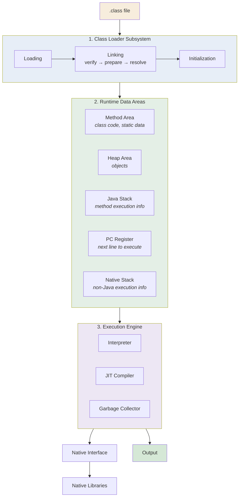
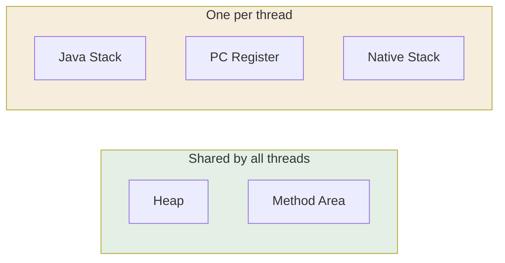

<div align="center">


  

</div>

---

> **In one line:** The JVM is Class Loader + Runtime Data Areas + Execution Engine, plus the native bridge.

## 1. What Is It?

**JVM** stands for **Java Virtual Machine**. It is part of the JRE, it cannot be seen with our eyes, and it is responsible for running Java programs, converting bytecode into a machine understandable format, and allocating and releasing memory.

## 2. JVM Architecture Diagram



## 3. Component Responsibilities

| Component | Responsibility |
|---|---|
| **Class Loader** | Loads the `.class` file into the JVM |
| **Method Area** | Stores class level code, metadata and static data |
| **Heap Area** | Stores all objects |
| **Java Stack** | Stores method execution information (frames, local variables) |
| **PC Register** | Maintains the next instruction to execute |
| **Native Stack** | Maintains non-Java (native) code execution information |
| **Native Interface** | Loads native libraries into the JVM |
| **Native Libraries** | Non-Java libraries needed for native execution |
| **Execution Engine** | Runs the program using the Interpreter and JIT, and provides the result |

## 4. Memory: Shared vs Per Thread



## 5. Simple Example

```java
public class MemoryDemo {
    public static void main(String[] args) {
        int count = 10;                 // local variable → Java Stack
        String name = new String("Kundan"); // object → Heap
        System.out.println(name + " " + count);
    }
}
```

## 6. Important Rules

- Heap and Method Area are shared; Stack, PC Register and Native Stack are per thread.
- Garbage collection cleans the **heap** only, never the stack.
- The JVM itself is platform specific; only bytecode is portable.

## 7. Common Mistakes

- Mixing up JDK, JRE and JVM.
- Expecting objects on the stack — objects always live in the heap.

## 8. Best Practices

- Map errors to memory areas while debugging: `OutOfMemoryError` points to the heap, `StackOverflowError` points to the Java stack.

## 9. In Depth

The JVM is best understood as three cooperating systems, and most runtime errors map directly onto one of its memory areas.

**Class loaders work in a delegation hierarchy.** The Bootstrap loader handles core classes from the JDK, the Platform (formerly Extension) loader handles platform modules, and the Application loader handles classes from the classpath. Each loader first delegates to its parent and only loads the class itself if the parent cannot. This ordering is a security feature: user code cannot replace `java.lang.String` with its own version, because the Bootstrap loader always answers first.

**Memory areas map to errors.**

| Area | Typical error | Meaning |
|---|---|---|
| Heap | `OutOfMemoryError: Java heap space` | Too many live objects, or a leak keeping them reachable |
| Method Area / Metaspace | `OutOfMemoryError: Metaspace` | Too many loaded classes, common in servers that redeploy applications |
| Java Stack | `StackOverflowError` | Recursion that never terminates |

**The execution engine balances speed and startup.** Interpreting begins immediately; the JIT compiles hot code later. The garbage collector runs alongside, reclaiming unreachable heap objects. Modern JVMs offer several collectors — G1 by default, ZGC and Shenandoah for very low pause times — and they differ only in how they trade throughput against pause duration, never in the program's semantics.

## 10. Quick Revision

> **JVM = Class Loader + Runtime Data Areas + Execution Engine (+ JNI).**
> JDK ⊃ JRE ⊃ JVM.

---

<div align="center">

<a href="09-Translators.md">← Translators</a> &nbsp;•&nbsp; <a href="../README.md">Home</a> &nbsp;•&nbsp; <a href="../02-Data-Types-and-Variables/README.md">Data Types and Variables →</a>


<sub>Core Java Theory Notes • Maintained by <b>Kundan</b></sub>

</div>
