  

---

> Start here. What Java is, why it is platform independent, how to install it, and what happens inside the JVM when a program runs.

## 📚 Topics In This Chapter

| # | Topic | What you will learn |
|---|---|---|
| 01 | [Java Introduction](./01-Java-Introduction.md) | History, editions and the WORA idea |
| 02 | [Java Features](./02-Java-Features.md) | The nine features that define the language |
| 03 | [Java Installation](./03-Java-Installation.md) | Install the JDK, set PATH, verify the setup |
| 04 | [Program Execution Flow](./04-Program-Execution-Flow.md) | Write ➜ compile ➜ execute, step by step |
| 05 | [Java Programming Elements](./05-Java-Programming-Elements.md) | package, import, class, variables, methods |
| 06 | [Java Program Development](./06-Java-Program-Development.md) | Build and run your first program by hand |
| 07 | [Compilation](./07-Compilation.md) | How javac turns source code into bytecode |
| 08 | [Execution](./08-Execution.md) | How the JVM runs a .class file |
| 09 | [Translators](./09-Translators.md) | Interpreter, compiler and assembler compared |
| 10 | [JVM Architecture](./10-JVM-Architecture.md) | Class loader, memory areas and execution engine |

## 🗺️ Learning Path

```mermaid
flowchart LR
    N0["01. Java Introduction"]
    N0 --> N1
    N1["02. Java Features"]
    N1 --> N2
    N2["03. Java Installation"]
    N2 --> N3
    N3["04. Program Execution Flow"]
    N3 --> N4
    N4["05. Java Programming Elements"]
    N4 --> N5
    N5["06. Java Program Development"]
    N5 --> N6
    N6["07. Compilation"]
    N6 --> N7
    N7["08. Execution"]
    N7 --> N8
    N8["09. Translators"]
    N8 --> N9
    N9["10. JVM Architecture"]
```

---

⬅️ <i>Start</i> &nbsp;•&nbsp; <a href="../README.md">🏠 Home</a> &nbsp;•&nbsp; <a href="../02-Data-Types-and-Variables/README.md">Data Types & Variables ➡️</a>

📘 Core Java Theory Notes • Maintained by <b>Kundan</b>

