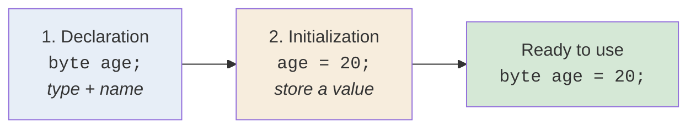
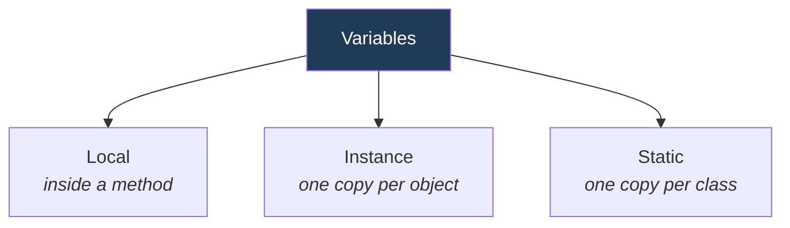

<div align="center">


  

</div>

---

> **In one line:** A variable is a named memory box; declare it with a type, then initialize it with a value.

## 1. What Is It?

A variable is used to **store data during program execution**. Every variable must be given a **data type** that decides what kind of data it can hold.

## 2. Two Steps To Use A Variable



## 3. Syntax

```java
dataType variableName;              // declaration
variableName = value;               // initialization
dataType variableName = value;      // both in one line
```

## 4. Simple Example

```java
public class VariableDemo {
    public static void main(String[] args) {
        int age = 20;
        double salary = 45000.50;
        char grade = 'A';
        String name = "Kundan";
        System.out.println(name + " | " + age + " | " + grade + " | " + salary);
    }
}
```

## 5. Types Of Variables



| Type | Declared | Stored in | Default value |
|---|---|---|---|
| Local | Inside a method or block | Java Stack | None — must be assigned |
| Instance | Inside a class, outside methods | Heap (with the object) | Type default |
| Static | With the `static` keyword | Method Area | Type default |

## 6. Important Rules

- The type must be written before the name.
- A local variable must be initialized before it is read.
- Names follow the identifier rules and are case sensitive.

## 7. Common Mistakes

- Using a local variable before assigning a value to it.
- Assigning a value that does not fit the type, such as `byte b = 200;`.

## 8. In Depth

A variable is really two things at once: a **name** used by the compiler and a **storage location** used at runtime. Where that storage lives decides the variable's lifetime.

Local variables live in a **stack frame**. A new frame is pushed for every method call and discarded when the method returns, which is why local variables cannot outlive their method and why deep recursion produces `StackOverflowError`. Because a frame is created fresh on every call, the compiler cannot give local variables a sensible default and instead requires **definite assignment**: every local must be provably assigned before it is read.

Instance variables live **inside the object** on the heap, so they exist for exactly as long as the object does. Static variables live in the **Method Area**, one copy per class, created when the class is initialized.

There is also a difference between a reference and the object it points to. `Student s;` creates a reference; `new Student()` creates the object. Assigning one reference to another copies the **address**, not the object, so both names then refer to the same instance — a frequent source of surprise when one method appears to modify another method's data.

**Scope** is the region where a name is visible, and shadowing occurs when an inner declaration reuses an outer name. That is why constructors commonly write `this.name = name`, where `this` disambiguates the field from the parameter.

## 9. Quick Revision

> **Declare → Initialize → Use.** Local lives in the stack, instance lives with the object, static lives with the class.

---

<div align="center">

<a href="../01-Java-Introduction-and-Setup/10-JVM-Architecture.md">← JVM Architecture</a> &nbsp;•&nbsp; <a href="../README.md">Home</a> &nbsp;•&nbsp; <a href="02-Data-Types.md">Data Types →</a>


<sub>Core Java Theory Notes • Maintained by <b>Kundan</b></sub>

</div>
