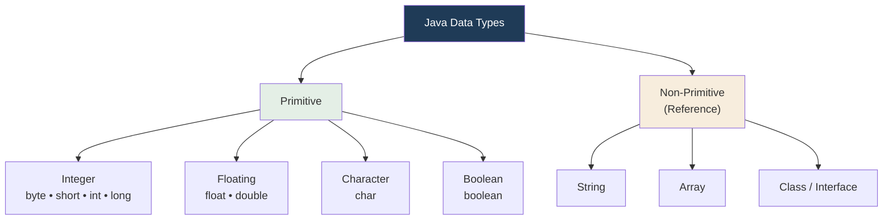

<div align="center">


  

</div>

---

> **In one line:** Eight primitive types plus non-primitive (reference) types decide size, range and default value.

## 1. What Is It?

Data types specify the **type of data** a variable can hold.

## 2. Data Type Tree



## 3. The Eight Primitive Types

| Type | Size | Range | Default |
|---|---|---|---|
| `byte` | 1 byte | -128 to 127 | `0` |
| `short` | 2 bytes | -32,768 to 32,767 | `0` |
| `int` | 4 bytes | -2,147,483,648 to 2,147,483,647 | `0` |
| `long` | 8 bytes | -2^63 to 2^63-1 | `0L` |
| `float` | 4 bytes | approx ±3.4e38 (7 digits) | `0.0f` |
| `double` | 8 bytes | approx ±1.7e308 (15 digits) | `0.0d` |
| `char` | 2 bytes | 0 to 65,535 (Unicode) | `'\u0000'` |
| `boolean` | 1 bit | `true` / `false` | `false` |

> **Note:** 8 bits = 1 byte.

## 4. char And boolean

- `char` stores a **single** character — alphabet, digit or special character — and **single quotes are mandatory**.
- `boolean` stores only `true` or `false`, and its default value is `false`.

## 5. String As A Data Type

`String` is a predefined class in the `java.lang` package used to store a **group of characters**. Every Java class can be used as a data type, which is why these are called **reference** data types. **Double quotes are mandatory** for String values.

```java
String name = "Kundan";
String email = "kundan@gmail.com";
String country = "India";
```

## 6. Simple Example

```java
public class DataTypeDemo {
    public static void main(String[] args) {
        int marks = 95;
        double percentage = 87.5;
        char section = 'B';
        boolean passed = true;
        System.out.println(marks + " " + percentage + " " + section + " " + passed);
    }
}
```

## 7. Important Rules

- Once a primitive type is declared, its **type** can never change, although its value usually can.
- `long` values end with `L`, `float` values end with `f`.
- `char` uses single quotes; `String` uses double quotes.

## 8. Common Mistakes

- Writing `char c = "A";` with double quotes.
- Expecting `float f = 10.5;` to compile — the literal is a `double`, so write `10.5f`.

## 9. In Depth

Java is **statically and strongly typed**: every variable's type is fixed at compile time and the compiler refuses operations that do not make sense for that type. This is what allows most errors to be caught before the program ever runs.

**Primitives versus references.** A primitive variable holds the value itself; a reference variable holds an address pointing at an object in the heap. Primitives are therefore faster and use less memory, which is why Java kept them instead of making everything an object.

**Type conversion** happens in two directions:

- **Widening (implicit)** — `byte → short → int → long → float → double`. Always safe, done automatically.
- **Narrowing (explicit)** — requires a cast, for example `int i = (int) 10.9;`, and may silently lose information; here the result is `10`, not `11`.

**Integer arithmetic rules that surprise beginners:** any arithmetic on `byte`, `short` or `char` is promoted to `int` before it is performed, so `byte a = 10, b = 20; byte c = a + b;` does not compile without a cast. Integer division truncates, so `5 / 2` is `2`, while `5 % 2` is `1`. Overflow does not raise an error — it wraps around, so `Integer.MAX_VALUE + 1` becomes the most negative `int`.

**Floating point is approximate.** `float` and `double` follow the IEEE 754 standard and cannot represent most decimal fractions exactly, so `0.1 + 0.2` does not equal `0.3`. Money should be handled with `BigDecimal`, never with `double`.

**`char` is numeric.** It stores a 16-bit unsigned Unicode code unit, so `char c = 65;` holds `'A'` and `'A' + 1` produces the `int` value 66.

## 10. Quick Revision

> 8 primitives grouped as **integer, floating, character, boolean**. Everything else is a reference type.

---

<div align="center">

<a href="01-Variables.md">← Variables</a> &nbsp;•&nbsp; <a href="../README.md">Home</a> &nbsp;•&nbsp; <a href="03-Identifiers-and-Rules.md">Identifiers and Rules →</a>


<sub>Core Java Theory Notes • Maintained by <b>Kundan</b></sub>

</div>
