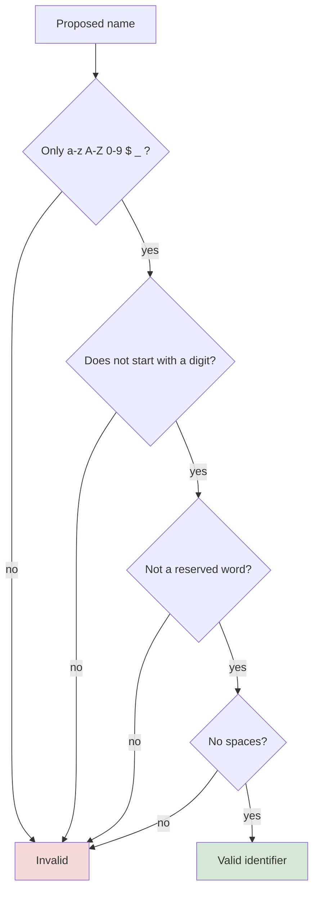

<div align="center">


  

</div>

---

> **In one line:** An identifier is any name you create — and it must obey five strict rules.

## 1. What Is It?

Every Java component needs a name. Names used for **classes, methods, interfaces and variables** are called **identifiers**.

## 2. Rule Checklist



## 3. The Five Rules

| Rule | Description |
|---|---|
| **Rule 1** | Allowed characters only: `a-z`, `A-Z`, `0-9`, `$`, `_` |
| **Rule 2** | Must not start with a digit |
| **Rule 3** | Reserved keywords cannot be used (53 reserved words exist) |
| **Rule 4** | Spaces are not allowed |
| **Rule 5** | Identifiers are **case sensitive** — `foo` and `Foo` are different |

## 4. Valid vs Invalid

| Name | Verdict | Reason |
|---|---|---|
| `name` | valid | letters only |
| `name@` | invalid | `@` is not allowed |
| `age#` | invalid | `#` is not allowed |
| `1age` | invalid | starts with a digit |
| `age2` | valid | digit is not first |
| `_name` | valid | underscore allowed |
| `$name` | valid | dollar allowed |
| `$_amt` | valid | both symbols allowed |
| `int byte = 20;` | invalid | `byte` is a reserved word |
| `int try = 30;` | invalid | `try` is a reserved word |
| `int mobile bill;` | invalid | space not allowed |
| `int mobile_bill;` | valid | underscore instead of space |

## 5. Simple Example

```java
public class IdentifierDemo {
    public static void main(String[] args) {
        int mobile_bill = 400;   // valid
        long phno = 797979799L;  // valid
        System.out.println(mobile_bill + " " + phno);
    }
}
```

## 6. Common Mistakes

- Using `@` or `#` inside names, copied from other languages.
- Assuming `Total` and `total` refer to the same variable.

## 7. In Depth

It helps to separate three ideas that are easy to merge into one.

- **Rules** are enforced by the compiler. Breaking one is a compile error.
- **Conventions** are enforced by teams and tools, not by the compiler. Breaking one still compiles but marks the code as unprofessional.
- **Reserved words** are fixed by the language specification; `true`, `false` and `null` are technically literals rather than keywords, but they are equally unusable as names.

Java identifiers are far more permissive than most developers realise. The specification allows any Unicode letter, so `नाम` or `año` are valid identifiers. This exists to support non-English source code, but in practice teams restrict themselves to ASCII for portability across editors and build systems.

`$` deserves a special note. It is legal, but by convention it is reserved for **machine-generated** code. The compiler itself uses it when naming inner classes (`Outer$Inner.class`) and synthetic members, so using `$` in hand-written code invites confusion.

Some words are **contextual keywords** added in later versions — `var`, `record`, `sealed`, `yield`, `permits`. They are only treated as keywords in the positions where they have a special meaning, precisely so that older code which used them as identifiers continues to compile.

## 8. Quick Revision

> Letters, digits, `$`, `_` only → never start with a digit → never a keyword → never a space → case matters.

---

<div align="center">

<a href="02-Data-Types.md">← Data Types</a> &nbsp;•&nbsp; <a href="../README.md">Home</a> &nbsp;•&nbsp; <a href="04-Reserved-Words.md">Reserved Words →</a>


<sub>Core Java Theory Notes • Maintained by <b>Kundan</b></sub>

</div>
