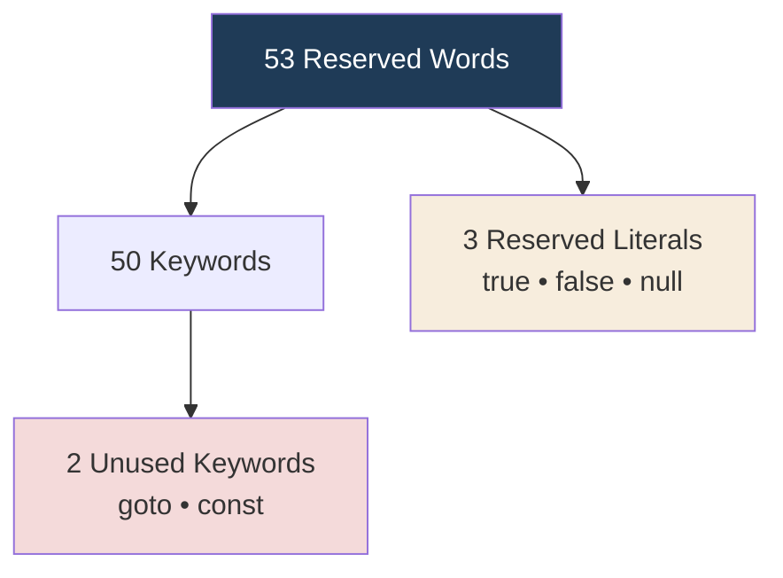

<div align="center">


  

</div>

---

> **In one line:** Java's 53 keywords are permanently reserved and can never be used as identifiers.

## 1. What Is It?

Reserved words are names already claimed by the language. Java has **53** of them.

## 2. Classification



## 3. Grouped By Purpose

| Group | Words |
|---|---|
| **Data types** | `byte` `short` `int` `long` `float` `double` `char` `boolean` |
| **Flow control** | `if` `else` `switch` `case` `default` `for` `while` `do` `break` `continue` `return` |
| **Access modifiers** | `public` `private` `protected` |
| **Other modifiers** | `static` `final` `abstract` `synchronized` `native` `strictfp` `transient` `volatile` |
| **Class related** | `class` `interface` `extends` `implements` `package` `import` `new` `instanceof` `super` `this` |
| **Exception handling** | `try` `catch` `finally` `throw` `throws` |
| **Return type** | `void` |
| **Enum** | `enum` |
| **Reserved literals** | `true` `false` `null` |
| **Unused** | `goto` `const` |

## 4. Simple Example

```java
public class KeywordDemo {
    public static void main(String[] args) {
        final int LIMIT = 100;   // final, int are keywords
        boolean active = true;   // true is a reserved literal
        System.out.println(LIMIT + " " + active);
    }
}
```

## 5. Important Rules

- All reserved words are written in **lowercase**.
- `goto` and `const` are reserved but have no function in Java.
- Reserved words can never be used as identifiers.

## 6. Common Mistakes

- Naming a variable `class`, `new` or `for`.
- Writing `True` or `NULL` — Java uses `true`, `false` and `null` in lowercase.

## 7. In Depth

The list of 53 reserved words has stayed almost unchanged since Java 1.0, and that stability is deliberate: adding a new keyword would break every existing program that used it as an identifier. This is why later language features avoided new keywords wherever possible.

Two words are reserved but do nothing. `goto` and `const` were reserved so that a program could not use them as identifiers, keeping the door open for future use and producing a clear error message for developers arriving from C and C++ rather than a confusing one.

Later features were added using three techniques that avoid claiming new keywords:

- **Existing keywords reused in a new position** — `default` inside an interface (Java 8), `static` inside an interface.
- **Contextual keywords** — `var` (Java 10), `record` and `yield` (Java 14), `sealed` and `permits` (Java 17). These are keywords only where they can have no other meaning, so a variable named `var` still compiles.
- **Annotations and symbols** rather than words — `@Override`, `->`, `::`.

Reserved words are also case sensitive. `Public` and `New` are perfectly legal identifiers, which is exactly why they must never be used.

## 8. Quick Revision

> **53 reserved = 50 keywords + 3 literals**, all lowercase, none usable as names.

---

<div align="center">

<a href="03-Identifiers-and-Rules.md">← Identifiers and Rules</a> &nbsp;•&nbsp; <a href="../README.md">Home</a> &nbsp;•&nbsp; <a href="05-Java-Coding-Standards.md">Java Coding Standards →</a>


<sub>Core Java Theory Notes • Maintained by <b>Kundan</b></sub>

</div>
