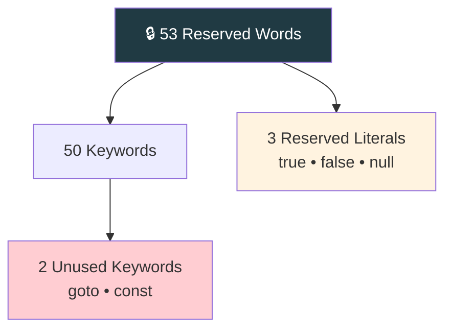

<div align="center">


  

</div>

---

> **In one line:** Java's 53 keywords are permanently reserved and can never be used as identifiers.

## 🧠 1. What Is It?

Reserved words are names already claimed by the language. Java has **53** of them.

## 🧩 2. Classification



## 📋 3. Grouped By Purpose

| Group | Words |
|---|---|
| **Data types** | `byte` `short` `int` `long` `float` `double` `char` `boolean` |
| **Flow control** | `if` `else` `switch` `case` `default` `for` `while` `do` `break` `continue` `return` |
| **Access modifiers** | `public` `private` `protected` |
| **Other modifiers** | `static` `final` `abstract` `synchronized` `native` `strictfp` `transient` `volatile` |
| **Class related** | `class` `interface` `extends` `implements` `package` `import` `new` `instanceof` `super` `this` |
| **Exception handling** | `try` `catch` `finally` `throw` `throws` |
| **Return type** | `void` |
| **Enum** | `enum` |
| **Reserved literals** | `true` `false` `null` |
| **Unused** | `goto` `const` |

## 🧪 4. Simple Example

```java
public class KeywordDemo {
    public static void main(String[] args) {
        final int LIMIT = 100;   // final, int are keywords
        boolean active = true;   // true is a reserved literal
        System.out.println(LIMIT + " " + active);
    }
}
```

## 📌 5. Important Rules

- All reserved words are written in **lowercase**.
- `goto` and `const` are reserved but have no function in Java.
- Reserved words can never be used as identifiers.

## ⚠️ 6. Common Mistakes

- Naming a variable `class`, `new` or `for`.
- Writing `True` or `NULL` — Java uses `true`, `false` and `null` in lowercase.

## 🔁 7. Quick Revision

> **53 reserved = 50 keywords + 3 literals**, all lowercase, none usable as names.

---

<div align="center">

<a href="03-Identifiers-and-Rules.md">⬅️ Identifiers and Rules</a> &nbsp;•&nbsp; <a href="../README.md">🏠 Home</a> &nbsp;•&nbsp; <a href="05-Java-Coding-Standards.md">Java Coding Standards ➡️</a>


<sub>📘 Core Java Theory Notes • Maintained by <b>Kundan</b></sub>

</div>
