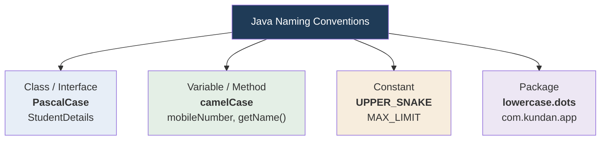

<div align="center">


  

</div>

---

> **In one line:** Naming conventions for classes, interfaces, variables, methods, constants and packages.

## 1. What Is It?

Java follows fixed naming standards for its own predefined packages, classes and methods, and recommends that every Java developer follow the same conventions. Following them is **not mandatory but highly recommended**.

## 2. Convention Map



## 3. Convention Table

| Element | Rule | Example |
|---|---|---|
| **Class** | Any number of words, no spaces; first letter of every word in uppercase | `EmployeeDetails` |
| **Interface** | Same rules as a class | `Printable` |
| **Variable** | Start with lowercase; from the second word onwards capitalise the first letter | `mobileNumber` |
| **Method** | Same as a variable, but written with parentheses | `calculateSalary()` |
| **Constant** | All characters uppercase; separate multiple words with `_` | `MAX_USER_COUNT` |
| **Package** | Lowercase only; separate words with a dot | `com.kundan.service` |

> **Note:** Variables and methods share the same convention. The difference is that methods carry `( )`.

## 4. Simple Example

```java
package com.kundan.demo;

public class EmployeeDetails {
    static final int MAX_LIMIT = 100;   // constant
    String employeeName;                // variable

    void printEmployeeName() {          // method
        System.out.println(employeeName);
    }
}
```

## 5. Common Mistakes

- Writing class names in lowercase, such as `employee`.
- Using underscores inside normal variable names instead of camelCase.
- Using uppercase letters in package names.

## 6. Best Practices

- Use nouns for classes, verbs for methods.
- Pick descriptive names: `totalAmount` beats `ta`.

## 7. In Depth

Conventions exist because code is read far more often than it is written, and because Java tooling depends on them. The JavaBeans specification, for example, defines a property purely by its method names: a field with `getName()` and `setName()` is a readable and writable property. Frameworks such as Spring, Hibernate and Jackson discover properties this way through reflection, so a getter named `fetchName()` simply will not be recognised.

Practical extensions to the basic conventions:

- Boolean getters conventionally begin with `is` rather than `get`, as in `isActive()`.
- Package names use a **reversed domain name** (`com.kundan.project.module`) so that two organisations can never produce a colliding package. Java keywords cannot appear in a package name, which is why some projects use `in_` style prefixes for country codes that clash.
- Classes are named with **nouns** (`InvoiceGenerator`), methods with **verbs** (`generateInvoice`), and boolean variables read like a statement (`isValid`, `hasPermission`).
- Constants are `static final` and written in upper case because their value is fixed at compile time; a `final` reference to a mutable object is not truly constant, since the object's contents can still change.
- Indentation of four spaces, braces on the same line and a line length of around 100 to 120 characters are the widely adopted defaults, usually enforced automatically by tools such as Checkstyle or an IDE formatter.

## 8. Quick Revision

> Class → `PascalCase` • variable/method → `camelCase` • constant → `UPPER_SNAKE_CASE` • package → `all.lowercase`.

---

<div align="center">

<a href="04-Reserved-Words.md">← Reserved Words</a> &nbsp;•&nbsp; <a href="../README.md">Home</a> &nbsp;•&nbsp; <a href="06-Java-Comments.md">Java Comments →</a>


<sub>Core Java Theory Notes • Maintained by <b>Kundan</b></sub>

</div>
