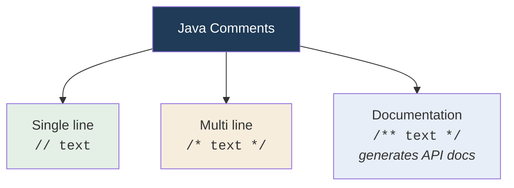

<div align="center">


  

</div>

---

> **In one line:** Single line, multi line and documentation comments are skipped by the compiler.

## 1. What Is It?

Comments are notes for humans. **Commented code does not participate in compilation or execution** — the compiler skips those lines.

## 2. Three Types



## 3. Syntax

```java
// this is a single line comment

/*
   this is a
   multi line comment
*/

/**
 * This is a documentation comment.
 * @author kundan
 */
```

## 4. Simple Example

```java
public class CommentDemo {
    public static void main(String[] args) {
        // print a greeting
        System.out.println("Hello");
        /* System.out.println("skipped"); */
    }
}
```

## 5. When To Use Which

| Type | Best for |
|---|---|
| `//` | A short note on one line |
| `/* */` | Temporarily disabling several lines |
| `/** */` | Public API descriptions processed by the `javadoc` tool |

## 6. Common Mistakes

- Nesting one `/* ... */` inside another — it does not compile.
- Explaining *what* the code does instead of *why* it does it.

## 7. Best Practices

- Write documentation comments above public classes and methods.
- Delete dead code instead of leaving it commented out forever.

## 8. In Depth

Comments are removed by the compiler during lexical analysis, so they never appear in the `.class` file and cost nothing at runtime. There is one exception in spirit: **annotations** look like metadata for humans but are real language constructs that can survive into the bytecode and be read at runtime by frameworks.

**Documentation comments** are the most valuable of the three because they feed the `javadoc` tool, which generates the HTML API documentation that the entire Java standard library ships with. Their standard tags describe a method's contract:

| Tag | Describes |
|---|---|
| `@param` | One parameter and its meaning |
| `@return` | What the method gives back |
| `@throws` | When an exception is raised |
| `@author`, `@since`, `@deprecated` | Ownership, version history, replacement advice | A practical principle: comments should explain **why**, not **what**. A comment repeating the code adds noise and quickly becomes wrong, because the code changes and the comment does not. Comments that justify a decision, warn about a non-obvious constraint or record a business rule remain useful for years.

Commented-out code is the one form worth eliminating entirely. Version control already remembers every deleted line, so keeping dead code in the file only creates doubt about whether it still matters.

## 9. Quick Revision

> `//` single line • `/* */` multi line • `/** */` documentation. All are invisible to the compiler.

---

<div align="center">

<a href="05-Java-Coding-Standards.md">← Java Coding Standards</a> &nbsp;•&nbsp; <a href="../README.md">Home</a> &nbsp;•&nbsp; <a href="07-Reading-Data-From-Keyboard.md">Reading Data From Keyboard →</a>


<sub>Core Java Theory Notes • Maintained by <b>Kundan</b></sub>

</div>
