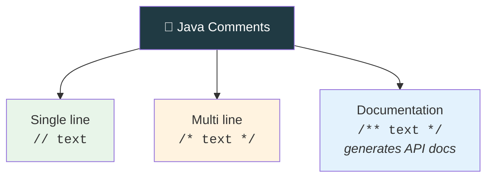

<div align="center">


  

</div>

---

> **In one line:** Single line, multi line and documentation comments are skipped by the compiler.

## 🧠 1. What Is It?

Comments are notes for humans. **Commented code does not participate in compilation or execution** — the compiler skips those lines.

## 🧩 2. Three Types



## 🧾 3. Syntax

```java
// this is a single line comment

/*
   this is a
   multi line comment
*/

/**
 * This is a documentation comment.
 * @author kundan
 */
```

## 🧪 4. Simple Example

```java
public class CommentDemo {
    public static void main(String[] args) {
        // print a greeting
        System.out.println("Hello");
        /* System.out.println("skipped"); */
    }
}
```

## 📋 5. When To Use Which

| Type | Best for |
|---|---|
| `//` | A short note on one line |
| `/* */` | Temporarily disabling several lines |
| `/** */` | Public API descriptions processed by the `javadoc` tool |

## ⚠️ 6. Common Mistakes

- Nesting one `/* ... */` inside another — it does not compile.
- Explaining *what* the code does instead of *why* it does it.

## ✅ 7. Best Practices

- Write documentation comments above public classes and methods.
- Delete dead code instead of leaving it commented out forever.

## 🔁 8. Quick Revision

> `//` single line • `/* */` multi line • `/** */` documentation. All are invisible to the compiler.

---

<div align="center">

<a href="05-Java-Coding-Standards.md">⬅️ Java Coding Standards</a> &nbsp;•&nbsp; <a href="../README.md">🏠 Home</a> &nbsp;•&nbsp; <a href="07-Reading-Data-From-Keyboard.md">Reading Data From Keyboard ➡️</a>


<sub>📘 Core Java Theory Notes • Maintained by <b>Kundan</b></sub>

</div>
