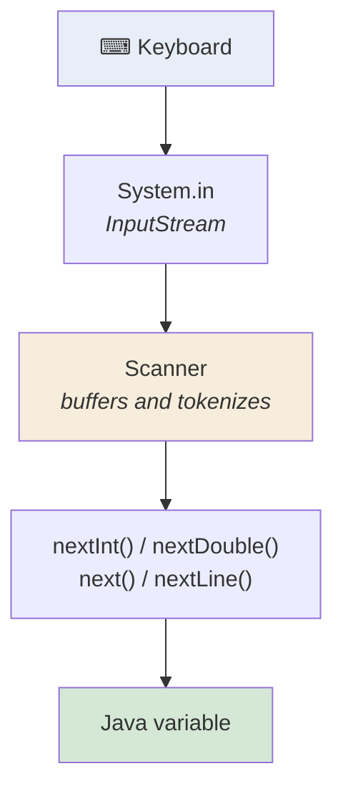

<div align="center">


  

</div>

---

> **In one line:** Scanner and BufferedReader let a program accept input at runtime.

## 1. What Is It?

We can pass input to a Java program so the logic runs on values typed by the user instead of hard-coded data.

Examples: read two numbers and print their sum, or read a first name and last name and print the full name.

Java gives two classes for keyboard input:

1. `java.util.Scanner`
2. `java.io.BufferedReader`

## 2. Input Flow



## 3. Syntax

```java
import java.util.Scanner;

Scanner sc = new Scanner(System.in);
int number = sc.nextInt();
String line = sc.nextLine();
sc.close();
```

## 4. Simple Example — Sum Of Two Numbers

```java
import java.util.Scanner;

public class SumDemo {
    public static void main(String[] args) {
        Scanner sc = new Scanner(System.in);
        System.out.print("Enter first number: ");
        int a = sc.nextInt();
        System.out.print("Enter second number: ");
        int b = sc.nextInt();
        System.out.println("Sum = " + (a + b));
        sc.close();
    }
}
```

## 5. Scanner Methods

| Method | Reads | Note |
|---|---|---|
| `nextInt()` | int | stops at whitespace |
| `nextLong()` | long | stops at whitespace |
| `nextFloat()` | float | stops at whitespace |
| `nextDouble()` | double | stops at whitespace |
| `nextBoolean()` | boolean | accepts `true` / `false` |
| `next()` | one word | stops at whitespace |
| `nextLine()` | whole line | reads up to the newline |

## 6. Important Rules

- `nextInt()`, `nextDouble()` and friends do **not** consume the trailing newline.
- Close the `Scanner` when the work is done.

## 7. Common Mistakes

- Calling `nextInt()` and then `nextLine()`: the leftover newline is eaten by `nextLine()`, which returns an empty String.
  **Fix:** add one extra `sc.nextLine();` after the numeric read.

## 8. Best Practices

- For predictable behaviour, read everything with `nextLine()` and convert with `Integer.parseInt(...)`.
- Validate with `hasNextInt()` before consuming input in real applications.

## 9. In Depth

`System.in` is a raw `InputStream` that delivers **bytes**, not text. Everything else is a layer that adds meaning on top of it, which explains why several classes exist for the same task.

| Layer | Adds |
|---|---|
| `System.in` | Raw bytes from the keyboard |
| `InputStreamReader` | Converts bytes into characters using a character set |
| `BufferedReader` | Buffers input and reads a whole line at a time |
| `Scanner` | Buffers, splits into tokens and parses them into typed values |

`Scanner` is convenient but does more work per call and is not synchronized. `BufferedReader` is faster for large input, returns only Strings, and its `readLine()` returns `null` at the end of input rather than throwing an exception.

The notorious `nextInt()` followed by `nextLine()` problem is a direct consequence of tokenizing: `nextInt()` consumes the digits and stops, deliberately leaving the newline in the buffer, and the following `nextLine()` consumes that leftover newline and returns an empty String.

Robust input handling in real programs uses `hasNextInt()` to test before consuming, wraps parsing in exception handling to survive bad input, and avoids closing a `Scanner` wrapped around `System.in` if more input may be needed later — closing the scanner also closes the underlying stream permanently.

## 10. Quick Revision

> `new Scanner(System.in)` → `nextInt()` / `nextLine()`. The leftover newline is the classic trap.

---

<div align="center">

<a href="06-Java-Comments.md">← Java Comments</a> &nbsp;•&nbsp; <a href="../README.md">Home</a> &nbsp;•&nbsp; <a href="../03-Operators-and-Control-Statements/README.md">Operators and Control Statements →</a>


<sub>Core Java Theory Notes • Maintained by <b>Kundan</b></sub>

</div>
