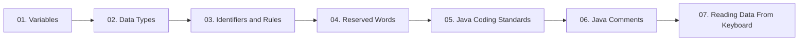

  

---

> How Java stores data: variables, the eight primitive types, naming rules, conventions, comments and keyboard input.

## 📚 Topics In This Chapter

| # | Topic | What you will learn |
|---|---|---|
| 01 | [Variables](./01-Variables.md) | Declaration, initialization and variable types |
| 02 | [Data Types](./02-Data-Types.md) | Primitive and non-primitive types with size and range |
| 03 | [Identifiers and Rules](./03-Identifiers-and-Rules.md) | The five rules for naming anything in Java |
| 04 | [Reserved Words](./04-Reserved-Words.md) | All 53 keywords and reserved literals |
| 05 | [Java Coding Standards](./05-Java-Coding-Standards.md) | Naming conventions for classes, methods and packages |
| 06 | [Java Comments](./06-Java-Comments.md) | Single line, multi line and documentation comments |
| 07 | [Reading Data From Keyboard](./07-Reading-Data-From-Keyboard.md) | Scanner and BufferedReader input |

## 🗺️ Learning Path

---

<a href="../01-Java-Introduction-and-Setup/README.md">⬅️ Java Introduction & Setup</a> &nbsp;•&nbsp; <a href="../README.md">🏠 Home</a> &nbsp;•&nbsp; <a href="../03-Operators-and-Control-Statements/README.md">Operators & Control Statements ➡️</a>

📘 Core Java Theory Notes • Maintained by <b>Kundan</b>

