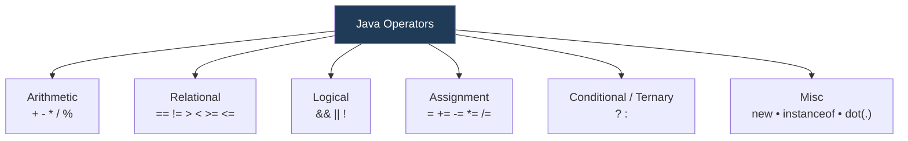
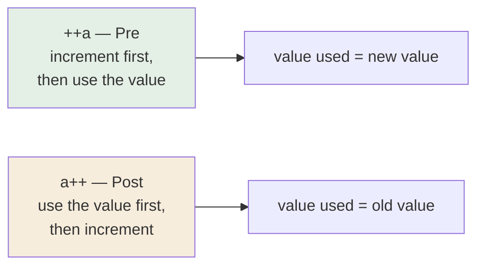
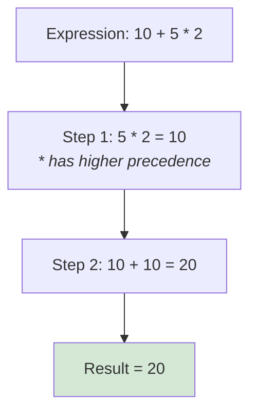

<div align="center">


  

</div>

---

> **In one line:** Symbols that tell the compiler to perform arithmetic, comparison, logical or assignment work.

## 1. What Is It?

An operator is a **symbol that tells the compiler to perform some operation**. Java provides a rich set of operators for every kind of work, and they are an essential part of every expression.

## 2. Operator Categories



## 3. Arithmetic Operators

| Operator | Meaning | Example (`a=10, b=3`) | Result |
|---|---|---|---|
| `+` | Addition | `a + b` | 13 |
| `-` | Subtraction | `a - b` | 7 |
| `*` | Multiplication | `a * b` | 30 |
| `/` | Division | `a / b` | 3 |
| `%` | Modulus (remainder) | `a % b` | 1 |

## 4. Increment And Decrement



Facts about `++` and `--`:

- Can be applied to **variables only**.
- Nesting the two operators is not allowed.
- Cannot be applied to `final` variables.
- Cannot be applied to `boolean`.

## 5. Relational Operators

| Operator | Meaning |
|---|---|
| `==` | equal to |
| `!=` | not equal to |
| `>` | greater than |
| `<` | less than |
| `>=` | greater than or equal to |
| `<=` | less than or equal to |

## 6. Logical Operators

With `a = true` and `b = false`:

| Operator | Name | `a op b` |
|---|---|---|
| `&&` | logical AND | `false` |
| `\|\|` | logical OR | `true` |
| `!` | logical NOT | `!a` is `false` |

## 7. Assignment Operators

| Operator | Meaning |
|---|---|
| `=` | assign |
| `+=` | add and assign |
| `-=` | subtract and assign |
| `*=` | multiply and assign |
| `/=` | divide and assign |
| `%=` | modulus and assign |

## 8. Conditional (Ternary) Operator

It works with three operands and is a short alternative to `if-else`.

```java
expr1 ? expr2 : expr3
```

```java
int a = 10, b = 20;
int max = (a > b) ? a : b;   // 20
```

## 9. Misc Operators

| Operator | Purpose |
|---|---|
| `new` | Creates an object; the object is placed in the **heap** memory of the JVM |
| `instanceof` | Tests whether a reference belongs to a given class or interface; returns `true` / `false` |
| `.` (dot) | Accesses members — `reference.variable`, `reference.method()`, `ClassName.method()` — and identifies a class inside a package, such as `java.lang.String` |

```java
String company = "Kundan Notes";
System.out.println(company instanceof String);   // true
```

## 10. Simple Example

```java
public class OperatorDemo {
    public static void main(String[] args) {
        int a = 10, b = 3;
        System.out.println(a + b);        // 13
        System.out.println(a % b);        // 1
        System.out.println(a > b);        // true
        System.out.println(a > b && b > 0); // true
    }
}
```

## 11. Precedence Flow



Precedence from high to low: postfix `++ --` → unary `++ -- + - !` → `* / %` → `+ -` → relational → equality → `&&` → `||` → `?:` → assignment.

## 12. Common Mistakes

- Confusing `=` (assign) with `==` (compare).
- Reading `2 + 3 * 4` strictly left to right — the answer is 14, not 20.
- Using `==` to compare String contents instead of `.equals()`.

## 13. Best Practices

- Add parentheses to make intent obvious even when precedence already handles it.

## 14. In Depth

Two ideas are often confused: **precedence** decides which operator binds its operands first, while **evaluation order** decides which operand is computed first. Java fixes the second completely: operands are always evaluated **left to right**, regardless of precedence. So in `f() + g() * h()`, `f()` is called first even though the multiplication is performed first.

**Short-circuit evaluation** is the most practically important behaviour here. `&&` does not evaluate its right operand when the left is false, and `||` skips it when the left is true. This is what makes `if (obj != null && obj.isValid())` safe. Their non-short-circuit counterparts `&` and `|` always evaluate both sides, and on integers the same symbols perform bitwise operations instead.

**Integer division and modulus** follow the type of their operands, so `5 / 2` is `2` while `5.0 / 2` is `2.5`. The `%` operator keeps the sign of the left operand, so `-7 % 3` is `-1`.

**Compound assignment hides a cast.** `b += 1` is not identical to `b = b + 1`; the compound form silently inserts a narrowing cast, which is why it compiles for a `byte` while the expanded version does not.

**The `+` operator is overloaded** — the only overloaded operator in Java. With two numbers it adds; with a String on either side it concatenates, converting the other operand by calling `String.valueOf()`. This is why `1 + 2 + "x"` gives `"3x"` while `"x" + 1 + 2` gives `"x12"`.

## 15. Quick Revision

> Operator = symbol, operand = value, expression = both together. Precedence picks the order, parentheses override it.

---

<div align="center">

<a href="../02-Data-Types-and-Variables/07-Reading-Data-From-Keyboard.md">← Reading Data From Keyboard</a> &nbsp;•&nbsp; <a href="../README.md">Home</a> &nbsp;•&nbsp; <a href="02-Control-Statements.md">Control Statements →</a>


<sub>Core Java Theory Notes • Maintained by <b>Kundan</b></sub>

</div>
