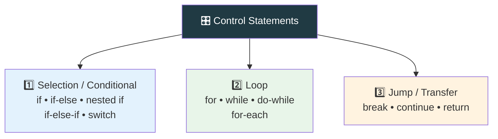
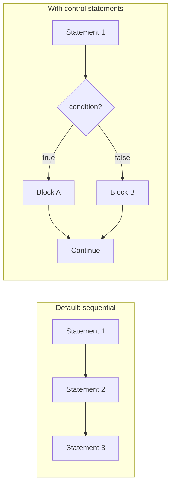

<div align="center">


  

</div>

---

> **In one line:** Control statements decide which part of the code runs, how often, and where control jumps next.

## 🧠 1. What Is It?

By default Java executes statements **in sequence, one after another**. Control statements let us decide whether a specific part of the code will run at all, run repeatedly, or be skipped.

## 🧩 2. The Three Families



## ⚙️ 3. Default Flow vs Controlled Flow



## 🧪 4. Simple Example

```java
public class ControlDemo {
    public static void main(String[] args) {
        int marks = 72;
        if (marks >= 35) {          // conditional
            System.out.println("Pass");
        }
        for (int i = 1; i <= 3; i++) {   // loop
            if (i == 2) continue;        // transfer
            System.out.println(i);
        }
    }
}
```

## 📋 5. Quick Map

| Family | Members | Purpose |
|---|---|---|
| Conditional | `if`, `if-else`, nested `if`, `if-else-if`, `switch` | Choose a block based on a condition |
| Loop | `for`, `while`, `do-while`, for-each | Repeat a block |
| Transfer | `break`, `continue`, `return` | Move control from one place to another |

## 🔁 6. Quick Revision

> Three families: **decide (conditional), repeat (loop), jump (transfer)**.

---

<div align="center">

<a href="01-Operators.md">⬅️ Operators</a> &nbsp;•&nbsp; <a href="../README.md">🏠 Home</a> &nbsp;•&nbsp; <a href="03-Conditional-Statements.md">Conditional Statements ➡️</a>


<sub>📘 Core Java Theory Notes • Maintained by <b>Kundan</b></sub>

</div>
