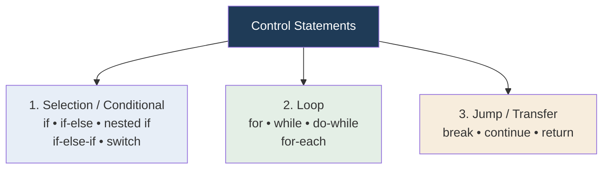
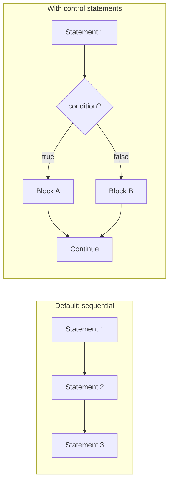

<div align="center">


  

</div>

---

> **In one line:** Control statements decide which part of the code runs, how often, and where control jumps next.

## 1. What Is It?

By default Java executes statements **in sequence, one after another**. Control statements let us decide whether a specific part of the code will run at all, run repeatedly, or be skipped.

## 2. The Three Families



## 3. Default Flow vs Controlled Flow



## 4. Simple Example

```java
public class ControlDemo {
    public static void main(String[] args) {
        int marks = 72;
        if (marks >= 35) {          // conditional
            System.out.println("Pass");
        }
        for (int i = 1; i <= 3; i++) {   // loop
            if (i == 2) continue;        // transfer
            System.out.println(i);
        }
    }
}
```

## 5. Quick Map

| Family | Members | Purpose |
|---|---|---|
| Conditional | `if`, `if-else`, nested `if`, `if-else-if`, `switch` | Choose a block based on a condition |
| Loop | `for`, `while`, `do-while`, for-each | Repeat a block |
| Transfer | `break`, `continue`, `return` | Move control from one place to another |

## 6. In Depth

Every control statement in Java is built from two primitives that the bytecode actually contains: a **conditional jump** and an **unconditional jump**. An `if` compiles to a comparison plus a jump over the block; a `while` loop compiles to a condition, a body and a jump back to the condition. Recognising this explains why a loop and a recursive method can express the same thing, and why `break` and `continue` cost nothing at runtime.

Structured programming, which Java follows, restricts those jumps to a few disciplined shapes — sequence, selection and iteration — because unrestricted jumping produces code that cannot be reasoned about. This is precisely why `goto` is reserved but unusable.

Two rules the compiler enforces around control flow are worth knowing:

- **Definite assignment.** A local variable must be assigned on every path that reaches its use. If it is assigned only inside an `if` with no `else`, the compiler rejects the later read.
- **Unreachable code.** Statements that can never execute, such as code after an unconditional `return` in the same block, are a compile error rather than a warning.

The condition in every Java control statement must be a **boolean**. Unlike C, a number or a reference cannot stand in for a condition, which eliminates the classic bug of writing `if (x = 5)` instead of `if (x == 5)`.

## 7. Quick Revision

> Three families: **decide (conditional), repeat (loop), jump (transfer)**.

---

<div align="center">

<a href="01-Operators.md">← Operators</a> &nbsp;•&nbsp; <a href="../README.md">Home</a> &nbsp;•&nbsp; <a href="03-Conditional-Statements.md">Conditional Statements →</a>


<sub>Core Java Theory Notes • Maintained by <b>Kundan</b></sub>

</div>
