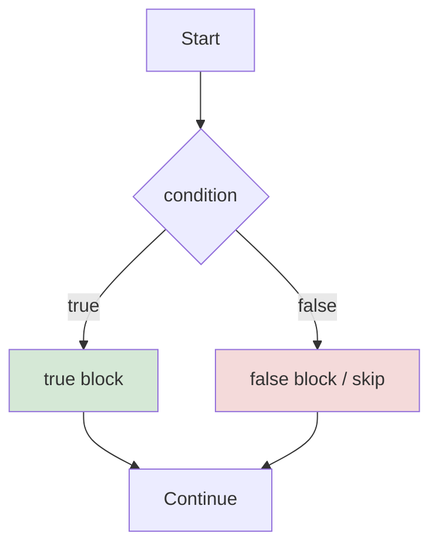
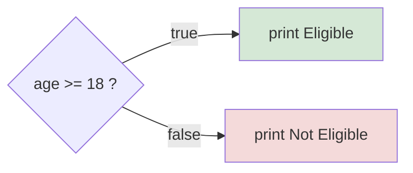
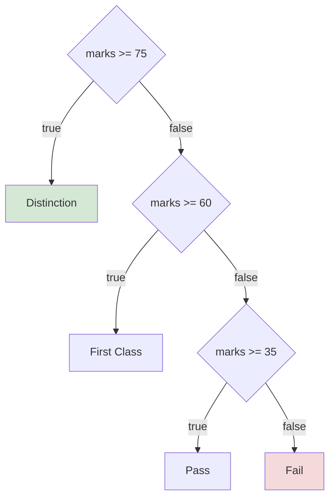
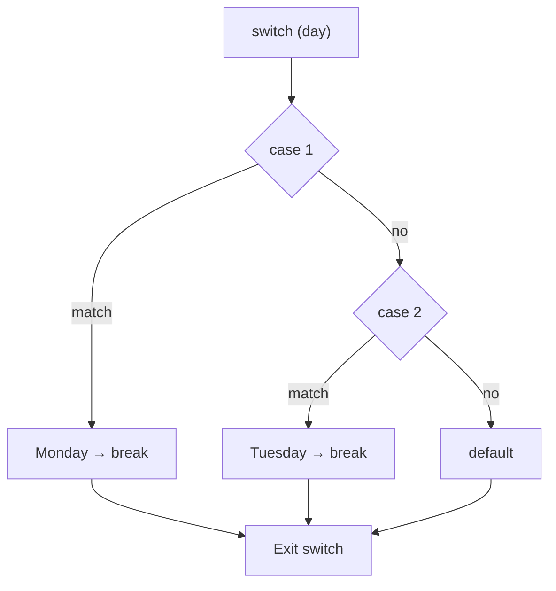

<div align="center">


  

</div>

---

> **In one line:** if, if-else, nested if, if-else-if and switch pick which block of code runs.

## 1. What Is It?

Conditional statements execute a group of statements **based on a condition**. They evaluate a **boolean expression** to make the decision.

## 2. Decision Flow



## 3. Simple if

If the condition is **true** the block runs; if it is **false** the block is ignored.

```java
if (condition) {
    // statements
}
```

```java
int age = 20;
if (age >= 18) {
    System.out.println("Eligible to vote");
}
```

## 4. if-else

Picks one block out of two.



```java
int age = 15;
if (age >= 18) {
    System.out.println("Eligible");
} else {
    System.out.println("Not Eligible");
}
```

## 5. Nested if

Writing an `if` inside another `if`.

```java
int age = 25;
double salary = 150000;
if (age < 30) {
    if (salary > 100000) {
        System.out.println("Eligible");
    }
}
```

## 6. if-else-if Ladder

Used when a value must be compared with **more than two** conditions. Conditions are checked **top to bottom**; the first match runs, and if nothing matches the final `else` runs.



```java
int marks = 62;
if (marks >= 75) {
    System.out.println("Distinction");
} else if (marks >= 60) {
    System.out.println("First Class");
} else if (marks >= 35) {
    System.out.println("Pass");
} else {
    System.out.println("Fail");
}
```

## 7. switch Statement

`switch` compares a value and executes one matching case block. It behaves like an `if-else-if` ladder.

Points to remember:

- There can be one or **N** cases.
- Case values must be **unique**.
- A case value must be of the **same type** as the switch expression.
- `break` in each case is **optional**, but without it execution falls through to the next case.



```java
int day = 2;
switch (day) {
    case 1:
        System.out.println("Monday");
        break;
    case 2:
        System.out.println("Tuesday");
        break;
    default:
        System.out.println("Other day");
}
```

## 8. Common Mistakes

- Using `=` instead of `==` inside the condition.
- Forgetting `break`, which causes unintended fall-through.
- Placing a semicolon right after `if (condition);` so the block always runs.

## 9. Best Practices

- Always use braces `{ }`, even for a single statement.
- Prefer `switch` over a long ladder when comparing one variable against fixed values.

## 10. In Depth

An `if-else if` ladder and a `switch` are not interchangeable, and the difference is both semantic and structural.

A ladder evaluates **arbitrary boolean expressions**, top to bottom, until one is true. Its cost grows with the number of conditions, and it can test ranges, multiple variables and method calls. A `switch` compares **one value against constants**, and the compiler can turn it into a jump table, so the matching case is reached in roughly constant time however many cases exist. This is why `switch` is preferred when comparing a single variable against many fixed values.

**Switch has grown over time.** It originally accepted only integer types and `char`; `enum` support arrived in Java 5, `String` support in Java 7, and Java 14 added the arrow form `case A -> ...`, which removes fall-through entirely and can return a value as an expression. Fall-through in the classic form is deliberate — it lets several labels share one block — but forgetting `break` is such a common mistake that the arrow form was introduced specifically to eliminate it.

**The ternary operator is an expression, not a statement.** It produces a value, so it can be used in an assignment or argument, but it should not carry side effects or be nested deeply — at that point an `if` reads better.

A subtle rule: an `else` always binds to the **nearest unmatched `if`**, regardless of indentation. Braces make that binding explicit and are the reason style guides insist on them even for single statements.

## 11. Quick Revision

> `if` → one path • `if-else` → two paths • ladder → many paths • `switch` → many fixed values.

---

<div align="center">

<a href="02-Control-Statements.md">← Control Statements</a> &nbsp;•&nbsp; <a href="../README.md">Home</a> &nbsp;•&nbsp; <a href="04-Looping-Statements.md">Looping Statements →</a>


<sub>Core Java Theory Notes • Maintained by <b>Kundan</b></sub>

</div>
