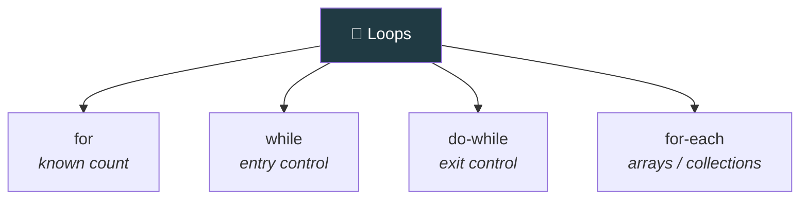
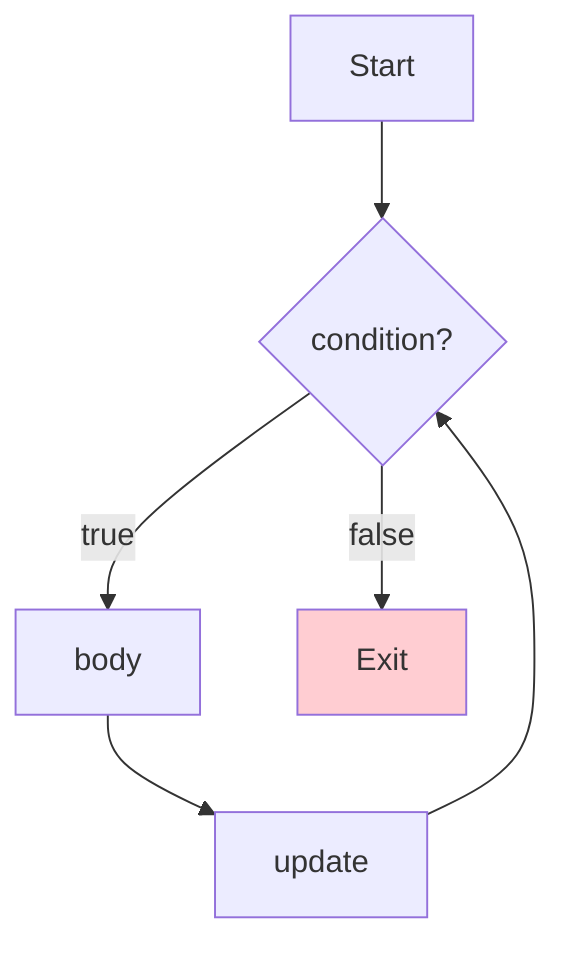
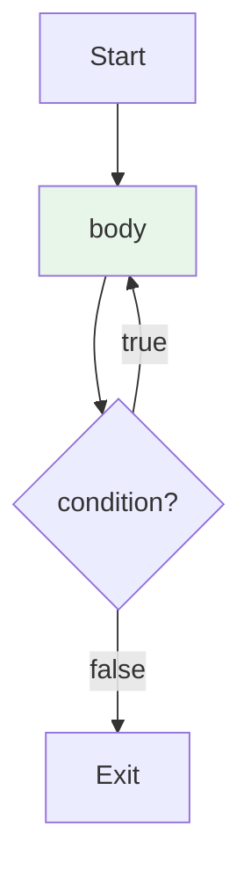
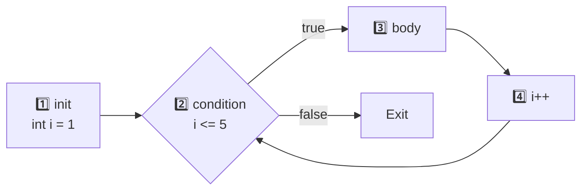

<div align="center">


  

</div>

---

> **In one line:** for, while, do-while and for-each repeat a block while a condition stays true.

## 🧠 1. What Is It?

A loop repeats a block of statements until the condition becomes false, or until every element of a collection has been visited. Instead of writing one print statement ten times, a loop does it once.

## 🧩 2. Loop Family



## 1️⃣ 3. while — Entry Control

The condition is checked **before** the body runs, so the body may run **zero** times.



```java
int i = 1;
while (i <= 5) {
    System.out.println(i);
    i++;
}
```

## 2️⃣ 4. do-while — Exit Control

The body runs **first**, then the condition is checked, so the body always runs **at least once**.



```java
int i = 1;
do {
    System.out.println(i);
    i++;
} while (i <= 5);
```

## 3️⃣ 5. for Loop

A `for` loop needs four parts:

| Part | Purpose | Optional? |
|---|---|---|
| **Initialization** | Sets the starting value, runs only once | Yes |
| **Condition** | Checked every pass; loop continues while true | Yes — omitting it makes the loop infinite |
| **Statement** | The loop body | — |
| **Increment / Decrement** | Moves the counter forward or backward | Yes |



```java
for (int i = 1; i <= 5; i++) {
    System.out.println(i);
}
```

## 4️⃣ 6. Nested for Loop

Writing a loop inside another loop.

```java
for (int i = 1; i <= 3; i++) {
    for (int j = 1; j <= 3; j++) {
        System.out.print(j + " ");
    }
    System.out.println();
}
```

## 5️⃣ 7. for-each (Enhanced for)

Introduced in Java 5.0, it walks through every element of an array or collection without an index.

```java
int[] numbers = {10, 20, 30};
for (int n : numbers) {
    System.out.println(n);
}
```

## 📋 8. while vs do-while vs for

| | while | do-while | for |
|---|---|---|---|
| Condition checked | Before the body | After the body | Before the body |
| Minimum runs | 0 | 1 | 0 |
| Control type | Entry | Exit | Entry |
| Best for | Unknown count | Run at least once | Known count |

## ⚠️ 9. Common Mistakes

- Forgetting the increment, which creates an infinite loop.
- Putting a semicolon after `for (...)` or `while (...)`.
- Off-by-one errors: `i <= n` versus `i < n`.

## ✅ 10. Best Practices

- Keep the loop variable scoped inside the `for` header.
- Use for-each when the index is not needed.

## 🔁 11. Quick Revision

> `while` = entry control, `do-while` = exit control (runs at least once), `for` = counted loop, for-each = element walk.

---

<div align="center">

<a href="03-Conditional-Statements.md">⬅️ Conditional Statements</a> &nbsp;•&nbsp; <a href="../README.md">🏠 Home</a> &nbsp;•&nbsp; <a href="05-Transfer-Statements.md">Transfer Statements ➡️</a>


<sub>📘 Core Java Theory Notes • Maintained by <b>Kundan</b></sub>

</div>
