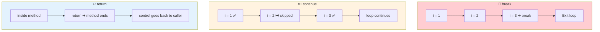

<div align="center">


  

</div>

---

> **In one line:** break, continue and return move control from one location to another.

## 🧠 1. What Is It?

Transfer statements are control statements used to **transfer control from one location to another**. Java has three: `break`, `continue` and `return`.

## 🧩 2. Comparison Diagram



## 1️⃣ 3. break

- Breaks the current execution flow.
- Can be used inside loops and `switch`.
- Inside a loop it **terminates the loop**.
- Inside the innermost loop it terminates **only that loop**, and execution continues with the outer loop.
- Inside `switch` it stops execution after the matched case.

```java
for (int i = 1; i <= 5; i++) {
    if (i == 3) {
        break;      // loop ends here
    }
    System.out.println(i);   // prints 1 2
}
```

## 2️⃣ 4. continue

- Skips the **current iteration** and jumps immediately to the next one.
- Works with `for`, `while` and `do-while`.

```java
for (int i = 1; i <= 5; i++) {
    if (i == 3) {
        continue;   // skip only 3
    }
    System.out.println(i);   // prints 1 2 4 5
}
```

## 3️⃣ 5. return

- Stops the continuity of **method** execution and hands control back to the caller.

```java
public class ReturnDemo {
    static int add(int a, int b) {
        return a + b;          // method ends here
    }

    public static void main(String[] args) {
        System.out.println(add(4, 6));   // 10
    }
}
```

## 📋 6. Side By Side

| Statement | Acts on | Effect |
|---|---|---|
| `break` | loop / switch | Exits the loop or switch completely |
| `continue` | loop | Skips the rest of this iteration only |
| `return` | method | Ends the method and returns control (and a value) to the caller |

## ⚠️ 7. Common Mistakes

- Expecting `break` inside a nested loop to exit **all** loops — it exits only the innermost one.
- Placing `continue` before the increment in a `while` loop, creating an infinite loop.
- Writing code after `return` in the same block, which is unreachable.

## ✅ 8. Best Practices

- Use labelled `break` sparingly; restructuring the loop is usually clearer.
- Prefer one clear exit point per method in simple logic.

## 🔁 9. Quick Revision

> `break` = leave the loop • `continue` = skip this pass • `return` = leave the method.

---

<div align="center">

<a href="04-Looping-Statements.md">⬅️ Looping Statements</a> &nbsp;•&nbsp; <a href="../README.md">🏠 Home</a> &nbsp;•&nbsp; <a href="../04-Arrays-and-Strings/README.md">Arrays & Strings ➡️</a>


<sub>📘 Core Java Theory Notes • Maintained by <b>Kundan</b></sub>

</div>
