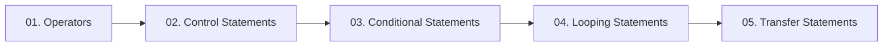

  

---

> How Java computes and decides: every operator category, plus the conditional, looping and transfer statements that shape program flow.

## 📚 Topics In This Chapter

| # | Topic | What you will learn |
|---|---|---|
| 01 | [Operators](./01-Operators.md) | Arithmetic, relational, logical, assignment, ternary and misc |
| 02 | [Control Statements](./02-Control-Statements.md) | The three families of flow control |
| 03 | [Conditional Statements](./03-Conditional-Statements.md) | if, if-else, nested if, ladder and switch |
| 04 | [Looping Statements](./04-Looping-Statements.md) | for, while, do-while, nested and for-each |
| 05 | [Transfer Statements](./05-Transfer-Statements.md) | break, continue and return |

## 🗺️ Learning Path

---

<a href="../02-Data-Types-and-Variables/README.md">⬅️ Data Types & Variables</a> &nbsp;•&nbsp; <a href="../README.md">🏠 Home</a> &nbsp;•&nbsp; <a href="../04-Arrays-and-Strings/README.md">Arrays & Strings ➡️</a>

📘 Core Java Theory Notes • Maintained by <b>Kundan</b>

