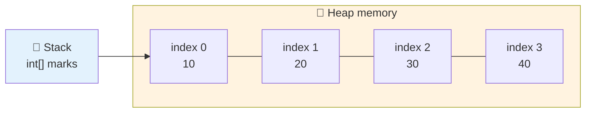
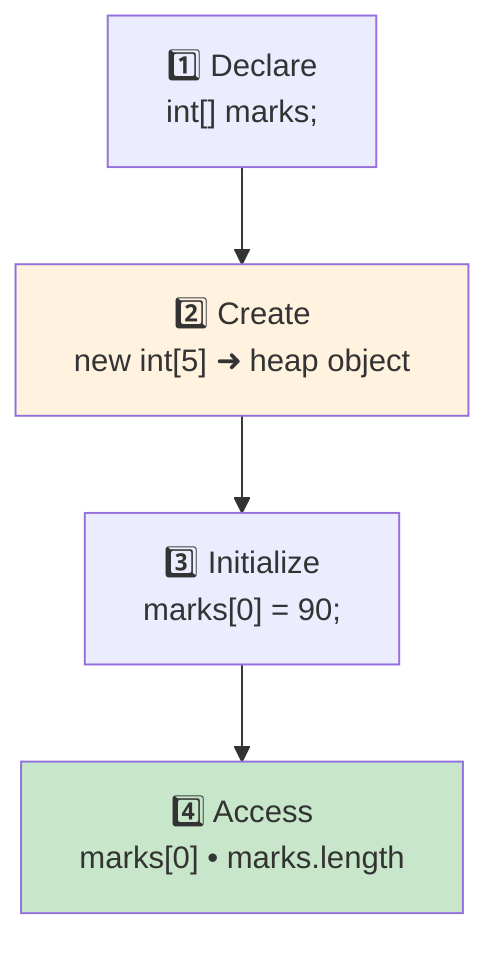

<div align="center">


  

</div>

---

> **In one line:** An array is a fixed-size container object that holds elements of the same data type.

## 🧠 1. What Is It?

An **array** is an object that contains elements of a **similar data type** — a container that holds values of a homogeneous type.

- Array is also called a **static data structure**, because its size must be specified at the time of declaration.
- An array is **index based**: the first element is at index `0`, the second at index `1`, and the last at `n-1`, where `n` is the length.
- In Java an array is treated as an **object** and is stored in **heap** memory.
- It can store primitive values or reference values.

## 🧩 2. Memory Layout



## 🧾 3. Syntax

```java
int[] marks = new int[5];          // declaration + creation
int[] data  = {10, 20, 30};        // declaration + initialization
```

## 📋 4. Types Of Arrays

| Type | Meaning | Example shape |
|---|---|---|
| **Single dimensional** | A simple linear list | `int[] a = new int[5];` |
| **Two dimensional** | Rows and columns (matrix) | `int[][] a = new int[3][3];` |
| **Multi dimensional** | Array of arrays of arrays | `int[][][] a;` |
| **Jagged** | Rows of different lengths | `int[][] a = new int[3][];` |

## ⚙️ 5. How It Works



- Every element gets the **default value** of its type when the array is created (`0`, `0.0`, `false`, `null`).
- `length` is a **field**, not a method — written as `marks.length` with no parentheses.

## ⚠️ 6. Limitations Of Arrays

1. **Fixed in size** — once created, the size can neither grow nor shrink, so the size must be known in advance.
2. **Homogeneous only** — an array can hold only one data type. A `Car[]` cannot store a `Bus`, which is a compile-time error. Using an `Object[]` works around this but loses type safety.
3. **No ready-made methods** — arrays are not built on a data structure, so there is no built-in support for searching, sorting or resizing; the code must be written explicitly.

> 📎 These limitations are exactly the reason the **Collections Framework** exists.

## 📌 7. Important Rules

- Index range is `0` to `length - 1`.
- Accessing an index outside that range throws `ArrayIndexOutOfBoundsException` at runtime.
- Arrays are objects, so an uninitialized array reference is `null`.

## ⚠️ 8. Common Mistakes

- Writing `marks.length()` instead of `marks.length`.
- Assuming the size can be changed later.
- Looping up to `length` inclusive instead of exclusive.

## 🔁 9. Quick Revision

> Array = fixed size + homogeneous + index based + heap object. Limitations ➜ Collections.

---

<div align="center">

<a href="../03-Operators-and-Control-Statements/05-Transfer-Statements.md">⬅️ Transfer Statements</a> &nbsp;•&nbsp; <a href="../README.md">🏠 Home</a> &nbsp;•&nbsp; <a href="02-String.md">String ➡️</a>


<sub>📘 Core Java Theory Notes • Maintained by <b>Kundan</b></sub>

</div>
