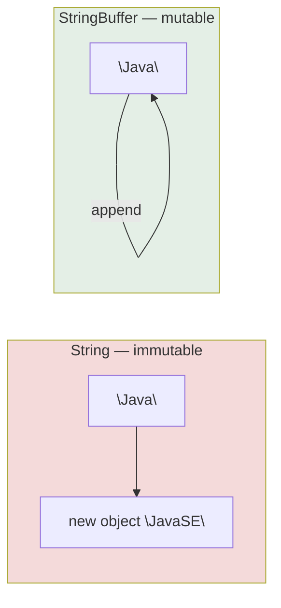

<div align="center">


  

</div>

---

> **In one line:** StringBuffer is a mutable, synchronized and thread-safe alternative to String.

## 1. What Is It?

`StringBuffer` is a **mutable** sequence of characters. Unlike `String`, its content can be modified **without creating a new object**.

## 2. String vs StringBuffer



## 3. How It Works

- Internally it holds a character array with a **capacity**.
- Default capacity is **16** characters.
- When the content exceeds the capacity, the new capacity becomes **(old capacity × 2) + 2**.
- All its methods are **synchronized**, which makes it **thread safe** but slightly slower.

## 4. Syntax

```java
StringBuffer sb = new StringBuffer("Java");
sb.append("Notes");
```

## 5. Common Methods

| Method | Purpose |
|---|---|
| `append(x)` | Adds at the end |
| `insert(index, x)` | Inserts at a position |
| `delete(start, end)` | Removes a range |
| `replace(start, end, str)` | Replaces a range |
| `reverse()` | Reverses the content |
| `capacity()` | Current capacity |
| `length()` | Current number of characters |

## 6. Important Rules

- Content changes happen **in place** — no new object is created.
- `StringBuffer` has no String constant pool.
- Use it when the same text is modified many times.

## 7. In Depth

`StringBuffer` wraps a character array and tracks how much of it is used. Appending writes into the free space; only when the array is full does it allocate a larger one and copy across. Because that copy is proportional to the current length and happens rarely, appending is **amortised constant time** — the reason a builder outperforms repeated String concatenation so dramatically.

Setting the capacity up front with `new StringBuffer(1000)` or `ensureCapacity()` removes the intermediate copies entirely when the final size is roughly known.

Synchronisation is the class's defining property and also its cost. Every method acquires the object's monitor, which was reasonable in Java 1.0 when there was no alternative, but a buffer is almost always a local variable used by one thread. That is why Java 5 introduced `StringBuilder` as an identical class with the locks removed, and why `StringBuffer` should now be chosen only when the same buffer really is shared between threads.

Even then, synchronising each method is often not enough: a sequence such as check-then-append is only safe if the whole sequence is synchronised by the caller.

## 8. Quick Revision

> StringBuffer = mutable + synchronized + thread safe. Capacity 16, grows as (n × 2) + 2.

---

<div align="center">

<a href="02-String.md">← String</a> &nbsp;•&nbsp; <a href="../README.md">Home</a> &nbsp;•&nbsp; <a href="04-StringBuilder.md">StringBuilder →</a>


<sub>Core Java Theory Notes • Maintained by <b>Kundan</b></sub>

</div>
