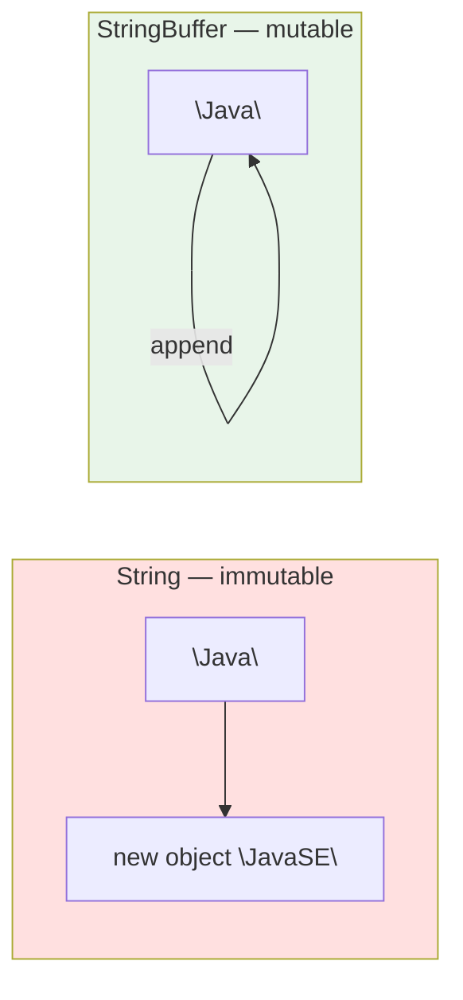

<div align="center">


  

</div>

---

> **In one line:** StringBuffer is a mutable, synchronized and thread-safe alternative to String.

## 🧠 1. What Is It?

`StringBuffer` is a **mutable** sequence of characters. Unlike `String`, its content can be modified **without creating a new object**.

## 🧩 2. String vs StringBuffer



## ⚙️ 3. How It Works

- Internally it holds a character array with a **capacity**.
- Default capacity is **16** characters.
- When the content exceeds the capacity, the new capacity becomes **(old capacity × 2) + 2**.
- All its methods are **synchronized**, which makes it **thread safe** but slightly slower.

## 🧾 4. Syntax

```java
StringBuffer sb = new StringBuffer("Java");
sb.append(" Notes");
```

## 📋 5. Common Methods

| Method | Purpose |
|---|---|
| `append(x)` | Adds at the end |
| `insert(index, x)` | Inserts at a position |
| `delete(start, end)` | Removes a range |
| `replace(start, end, str)` | Replaces a range |
| `reverse()` | Reverses the content |
| `capacity()` | Current capacity |
| `length()` | Current number of characters |

## 📌 6. Important Rules

- Content changes happen **in place** — no new object is created.
- `StringBuffer` has no String constant pool.
- Use it when the same text is modified many times.

## 🔁 7. Quick Revision

> StringBuffer = mutable + synchronized + thread safe. Capacity 16, grows as (n × 2) + 2.

---

<div align="center">

<a href="02-String.md">⬅️ String</a> &nbsp;•&nbsp; <a href="../README.md">🏠 Home</a> &nbsp;•&nbsp; <a href="04-StringBuilder.md">StringBuilder ➡️</a>


<sub>📘 Core Java Theory Notes • Maintained by <b>Kundan</b></sub>

</div>
