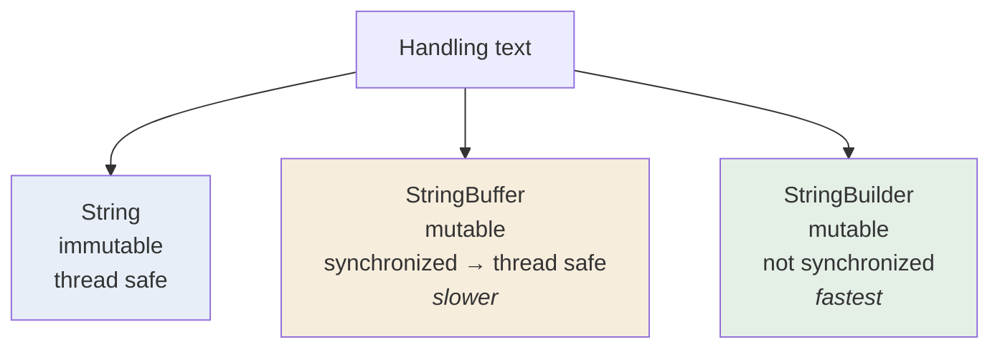

<div align="center">


  

</div>

---

> **In one line:** StringBuilder is the non-synchronized, faster version of StringBuffer.

## 1. What Is It?

`StringBuilder` was introduced in **Java 1.5** and offers exactly the same methods as `StringBuffer`, but **without synchronization**.

## 2. The Three Compared



## 3. Comparison Table

| Feature | String | StringBuffer | StringBuilder |
|---|---|---|---|
| Mutable | No | Yes | Yes |
| Thread safe | Yes (immutable) | Yes (synchronized) | No |
| Performance | Slow for edits | Moderate | Fastest |
| Introduced in | 1.0 | 1.0 | 1.5 |
| Stored in pool | Literals only | No | No |

## 4. Syntax

```java
StringBuilder sb = new StringBuilder("Java");
sb.append("Notes").reverse();
```

## 5. Which One To Choose


## 6. In Depth

`StringBuilder` and `StringBuffer` share a common package-private parent, `AbstractStringBuilder`, which contains all the real logic. The two subclasses differ only in whether their methods carry the `synchronized` modifier, so the behaviour is otherwise identical and switching between them requires no other change.

The performance gap is smaller than it once was, because the JVM can often eliminate uncontended locks through escape analysis and lock elision, but `StringBuilder` remains the correct default because it communicates intent: this buffer belongs to one thread.

Method chaining works because every mutating method returns `this`, allowing `sb.append(a).append(b).reverse()`. This is a small example of the fluent interface pattern used throughout the modern Java libraries.

Two practical notes: `toString()` copies the characters into a new immutable String, so it should be called once at the end rather than inside a loop; and `setLength(0)` reuses an existing builder without allocating a new one, which is useful in tight loops.

## 7. Quick Revision

> Same API as StringBuffer, minus synchronization. Single thread → StringBuilder; shared threads → StringBuffer.

---

<div align="center">

<a href="03-StringBuffer.md">← StringBuffer</a> &nbsp;•&nbsp; <a href="../README.md">Home</a> &nbsp;•&nbsp; <a href="05-Command-Line-Arguments.md">Command Line Arguments →</a>


<sub>Core Java Theory Notes • Maintained by <b>Kundan</b></sub>

</div>
