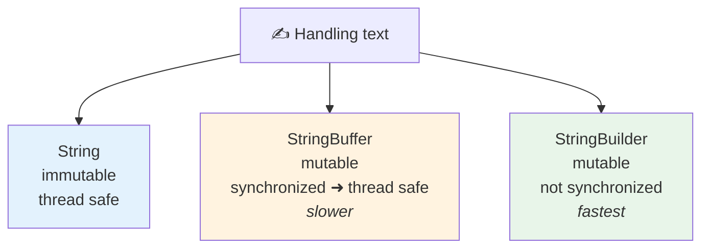
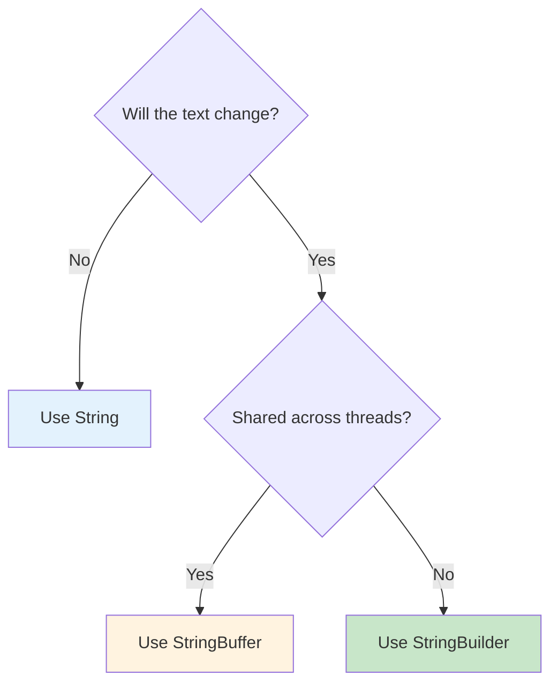

<div align="center">


  

</div>

---

> **In one line:** StringBuilder is the non-synchronized, faster version of StringBuffer.

## 🧠 1. What Is It?

`StringBuilder` was introduced in **Java 1.5** and offers exactly the same methods as `StringBuffer`, but **without synchronization**.

## 🧩 2. The Three Compared



## 📋 3. Comparison Table

| Feature | String | StringBuffer | StringBuilder |
|---|---|---|---|
| Mutable | ❌ No | ✅ Yes | ✅ Yes |
| Thread safe | ✅ Yes (immutable) | ✅ Yes (synchronized) | ❌ No |
| Performance | Slow for edits | Moderate | Fastest |
| Introduced in | 1.0 | 1.0 | 1.5 |
| Stored in pool | ✅ Literals only | ❌ No | ❌ No |

## 🧾 4. Syntax

```java
StringBuilder sb = new StringBuilder("Java");
sb.append(" Notes").reverse();
```

## ✅ 5. Which One To Choose



## 🔁 6. Quick Revision

> Same API as StringBuffer, minus synchronization. Single thread ➜ StringBuilder; shared threads ➜ StringBuffer.

---

<div align="center">

<a href="03-StringBuffer.md">⬅️ StringBuffer</a> &nbsp;•&nbsp; <a href="../README.md">🏠 Home</a> &nbsp;•&nbsp; <a href="05-Command-Line-Arguments.md">Command Line Arguments ➡️</a>


<sub>📘 Core Java Theory Notes • Maintained by <b>Kundan</b></sub>

</div>
