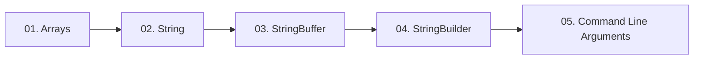

  

---

> Storing groups of values with arrays, and handling text with String, StringBuffer and StringBuilder.

## 📚 Topics In This Chapter

| # | Topic | What you will learn |
|---|---|---|
| 01 | [Arrays](./01-Arrays.md) | Declaration, memory layout, types and limitations of arrays |
| 02 | [String](./02-String.md) | Immutability, the String constant pool and common methods |
| 03 | [StringBuffer](./03-StringBuffer.md) | Mutable text handling with synchronized methods |
| 04 | [StringBuilder](./04-StringBuilder.md) | The fast, non-synchronized mutable string class |
| 05 | [Command Line Arguments](./05-Command-Line-Arguments.md) | Passing values into a program at launch time |

## 🗺️ Learning Path

---

<a href="../03-Operators-and-Control-Statements/README.md">⬅️ Transfer Statements</a> &nbsp;•&nbsp; <a href="../README.md">🏠 Home</a> &nbsp;•&nbsp; <a href="../05-OOPS-Part-1/README.md">OOPS Part 1 ➡️</a>

📘 Core Java Theory Notes • Maintained by <b>Kundan</b>

