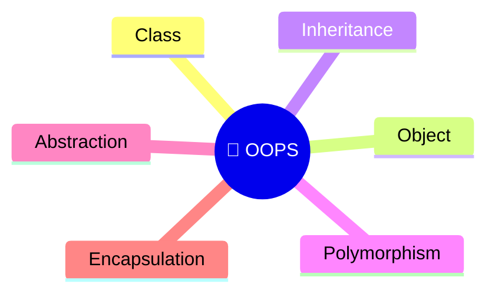
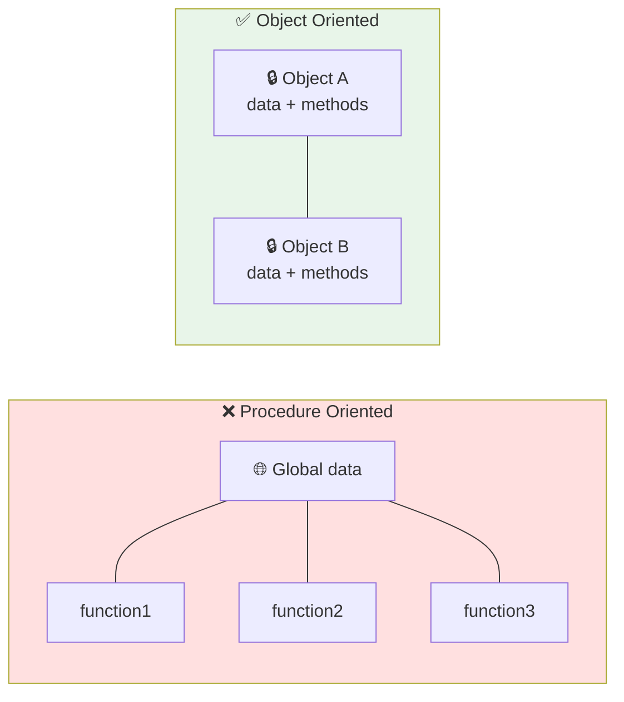

  

---

> **In one line:** Object oriented programming organises software as objects that carry data and behaviour.

## 🧠 1. What Is It?

Programming languages are divided into two types:

| Type | Built from | Examples |
|---|---|---|
| **Procedure Oriented (POP)** | Functions and procedures | C, COBOL, Pascal |
| **Object Oriented (OOP)** | Classes and objects | Java, C#, Python |

Any language that follows the OOP principles is called an OOP language.

## ⚠️ 2. Problems With Procedure Oriented Programming

- Adding functionality means writing more and more functions.
- Maintaining and managing a large number of functions is difficult.
- Data is **exposed globally**.
- There is **no security** for the data.

## 🧩 3. OOP Principles

| Principle | One-line meaning |
|---|---|
| **Class** | The blueprint or plan |
| **Object** | A real instance built from the blueprint |
| **Inheritance** | Reusing the properties of one class in another |
| **Polymorphism** | One name behaving in many forms |
| **Abstraction** | Showing what it does, hiding how it does it |
| **Encapsulation** | Binding data and methods together and protecting the data |

## ⚖️ 4. POP vs OOP

| Aspect | POP | OOP |
|---|---|---|
| Building block | Function | Object |
| Data access | Global, open | Controlled by the object |
| Security | None | Data is protected |
| Reuse | Copy the function | Inheritance |
| Maintenance | Hard as it grows | Modular and easier |

## 🔁 5. Quick Revision

> OOP organises software as objects that hold **data + behaviour**, giving security, reuse and easier maintenance.

---

<a href="../04-Arrays-and-Strings/05-Command-Line-Arguments.md">⬅️ Command Line Arguments</a> &nbsp;•&nbsp; <a href="../README.md">🏠 Home</a> &nbsp;•&nbsp; <a href="02-Classes.md">Classes ➡️</a>

📘 Core Java Theory Notes • Maintained by <b>Kundan</b>

