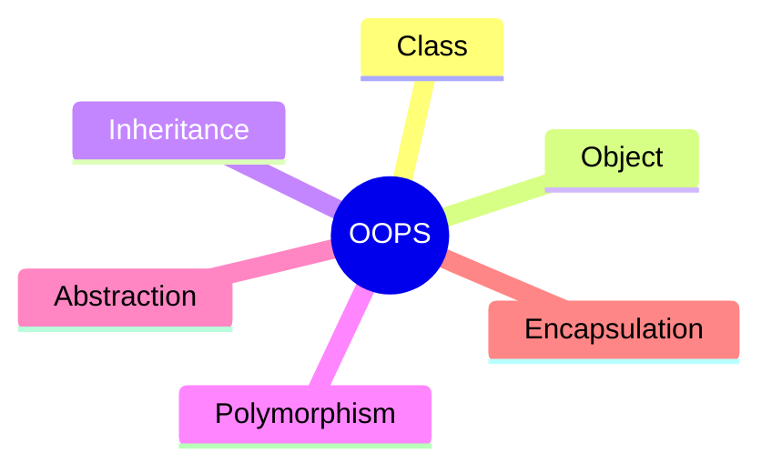
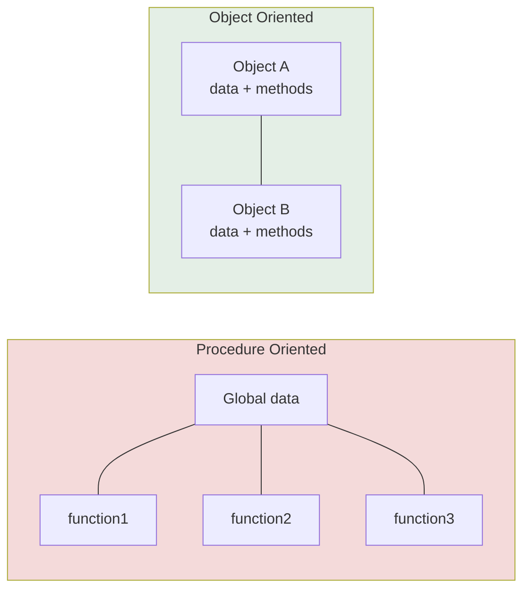

  

---

> **In one line:** Object oriented programming organises software as objects that carry data and behaviour.

## 1. What Is It?

Programming languages are divided into two types:

| Type | Built from | Examples |
|---|---|---|
| **Procedure Oriented (POP)** | Functions and procedures | C, COBOL, Pascal |
| **Object Oriented (OOP)** | Classes and objects | Java, C#, Python | Any language that follows the OOP principles is called an OOP language.

## 2. Problems With Procedure Oriented Programming

- Adding functionality means writing more and more functions.
- Maintaining and managing a large number of functions is difficult.
- Data is **exposed globally**.
- There is **no security** for the data.

## 3. OOP Principles

| Principle | One-line meaning |
|---|---|
| **Class** | The blueprint or plan |
| **Object** | A real instance built from the blueprint |
| **Inheritance** | Reusing the properties of one class in another |
| **Polymorphism** | One name behaving in many forms |
| **Abstraction** | Showing what it does, hiding how it does it |
| **Encapsulation** | Binding data and methods together and protecting the data |

## 4. POP vs OOP

| Aspect | POP | OOP |
|---|---|---|
| Building block | Function | Object |
| Data access | Global, open | Controlled by the object |
| Security | None | Data is protected |
| Reuse | Copy the function | Inheritance |
| Maintenance | Hard as it grows | Modular and easier |

## 5. In Depth

The deeper argument for object orientation is about **managing change**. In a procedural program, data structures are shared and functions everywhere depend on their exact shape, so changing one structure ripples through the whole codebase. In an object oriented program, data is owned by an object and reached only through its methods, so the internal representation can change while the surrounding code stays untouched.

Two relationships describe how classes are connected, and choosing correctly between them is a large part of good design:

- **IS-A** — inheritance. A `SavingsAccount` *is an* `Account`.
- **HAS-A** — composition. A `Car` *has an* `Engine`.

Composition is usually preferred, because inheritance permanently couples a subclass to its parent's implementation, while composition can be changed at runtime.

Object orientation also makes **polymorphic substitution** possible: code written against a general type keeps working when a new specific type appears. This is what lets frameworks call code that did not exist when the framework was written.

Java is not purely object oriented, because primitives are not objects and static members belong to classes rather than instances. These are deliberate performance compromises, not oversights.

## 6. Quick Revision

> OOP organises software as objects that hold **data + behaviour**, giving security, reuse and easier maintenance.

---

<a href="../04-Arrays-and-Strings/05-Command-Line-Arguments.md">← Command Line Arguments</a> &nbsp;•&nbsp; <a href="../README.md">Home</a> &nbsp;•&nbsp; <a href="02-Classes.md">Classes →</a>

Core Java Theory Notes • Maintained by <b>Kundan</b>

