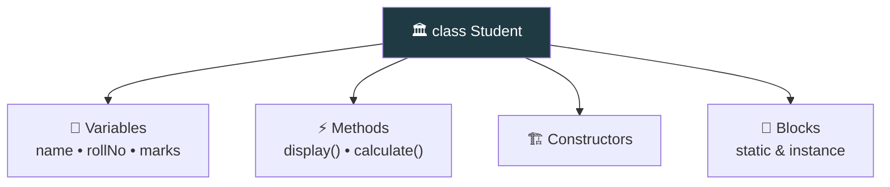

<div align="center">


  

</div>

---

> **In one line:** A class is the plan or blueprint that defines what data and behaviour an object will have.

## 🧠 1. What Is It?

A **class** is a plan used to define program elements. Inside a class we write **variables** (data) and **methods** (behaviour). A class is a **logical entity** — it occupies no memory until an object is created from it.

## 🧩 2. Anatomy Of A Class



## 🧾 3. Syntax

```java
class Student {
    int rollNo;              // variable
    void display() { }       // method
}
```

## 📋 4. Members Of A Class

| Member | Purpose |
|---|---|
| **Variables** | Store the state of the object |
| **Methods** | Define the behaviour |
| **Constructors** | Initialize a new object |
| **Static block** | Runs once when the class is loaded |
| **Instance block** | Runs each time an object is created |
| **Inner class** | A class inside another class |

## 📌 5. Important Rules

- Only **one public class** per file, and the file name must match it.
- A class name follows the **PascalCase** convention.
- A class is a **logical** entity; an object is a **physical** entity.

## 🔁 6. Quick Revision

> Class = blueprint (logical, no memory). It groups variables, methods, constructors and blocks.

---

<div align="center">

<a href="01-OOPS-Introduction.md">⬅️ OOPS Introduction</a> &nbsp;•&nbsp; <a href="../README.md">🏠 Home</a> &nbsp;•&nbsp; <a href="03-Objects.md">Objects ➡️</a>


<sub>📘 Core Java Theory Notes • Maintained by <b>Kundan</b></sub>

</div>
