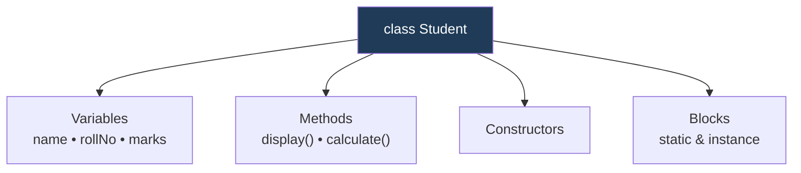

<div align="center">


  

</div>

---

> **In one line:** A class is the plan or blueprint that defines what data and behaviour an object will have.

## 1. What Is It?

A **class** is a plan used to define program elements. Inside a class we write **variables** (data) and **methods** (behaviour). A class is a **logical entity** — it occupies no memory until an object is created from it.

## 2. Anatomy Of A Class



## 3. Syntax

```java
class Student {
    int rollNo;              // variable
    void display() { }       // method
}
```

## 4. Members Of A Class

| Member | Purpose |
|---|---|
| **Variables** | Store the state of the object |
| **Methods** | Define the behaviour |
| **Constructors** | Initialize a new object |
| **Static block** | Runs once when the class is loaded |
| **Instance block** | Runs each time an object is created |
| **Inner class** | A class inside another class |

## 5. Important Rules

- Only **one public class** per file, and the file name must match it.
- A class name follows the **PascalCase** convention.
- A class is a **logical** entity; an object is a **physical** entity.

## 6. In Depth

A class is both a compile-time construct and a runtime entity. At compile time it defines types and checks member access. At runtime the JVM creates one `Class` object in the Method Area the first time the class is actively used, holding its metadata, static fields and method bytecode.

That loading happens in a fixed order, which explains why initialisation code behaves the way it does:

1. Static variables receive default values, then static initialisers and static blocks run **once**, in source order, when the class is first used.
2. On every `new`, instance variables receive default values, instance initialiser blocks run, and then the constructor body executes.

A class also defines a **type**, and a type is not the same thing as an implementation. A variable's declared type decides which members the compiler will allow; the object's actual class decides which overridden method runs. Keeping that distinction clear removes most confusion around polymorphism later.

Modern Java adds specialised class forms for common cases: `record` for immutable data carriers with generated constructor, accessors, `equals`, `hashCode` and `toString`; `enum` for a fixed set of instances; and `sealed` classes for restricting which classes may extend a type.

## 7. Quick Revision

> Class = blueprint (logical, no memory). It groups variables, methods, constructors and blocks.

---

<div align="center">

<a href="01-OOPS-Introduction.md">← OOPS Introduction</a> &nbsp;•&nbsp; <a href="../README.md">Home</a> &nbsp;•&nbsp; <a href="03-Objects.md">Objects →</a>


<sub>Core Java Theory Notes • Maintained by <b>Kundan</b></sub>

</div>
