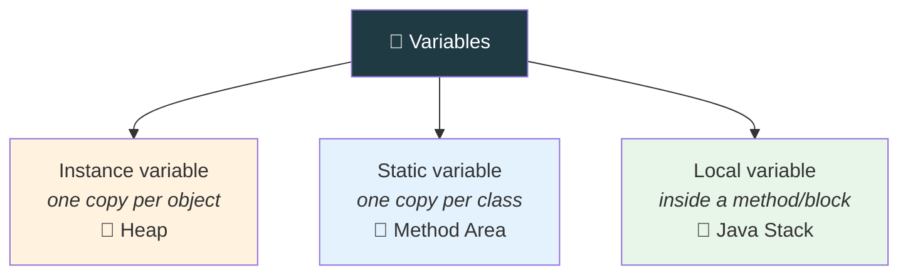

<div align="center">


  

</div>

---

> **In one line:** Instance, static and local variables differ in where they live, when they are created and who shares them.

## 🧠 1. What Is It?

Based on **where** a variable is declared and **how** it is shared, Java variables fall into three types.

## 🧩 2. Variable Types



## 📋 3. Full Comparison

| | Instance | Static | Local |
|---|---|---|---|
| Declared | Inside a class, outside methods | Inside a class with `static` | Inside a method, block or constructor |
| Copies | One per object | One shared by all objects | One per method call |
| Memory | Heap (with the object) | Method Area | Java Stack |
| Created | When the object is created | When the class is loaded | When the method is called |
| Destroyed | When the object is collected | When the class is unloaded | When the method ends |
| Default value | Yes (0, false, null) | Yes (0, false, null) | ❌ None — must be assigned |
| Accessed by | `reference.variable` | `ClassName.variable` | Directly inside its block |

## 🧾 4. Syntax

```java
class Demo {
    int instanceVar;             // instance
    static int staticVar;        // static
    void show() {
        int localVar = 10;       // local
    }
}
```

## 📌 5. Important Rules

- A static variable is shared, so a change made through one object is visible to all.
- A local variable **must** be initialized before it is read — there is no default.
- Static members are loaded before any object exists.

## ⚠️ 6. Common Mistakes

- Expecting a local variable to have a default value.
- Accessing an instance variable from a `static` method without an object.

## 🔁 7. Quick Revision

> Instance ➜ per object (heap) • Static ➜ per class (method area) • Local ➜ per call (stack, no default).

---

<div align="center">

<a href="03-Objects.md">⬅️ Objects</a> &nbsp;•&nbsp; <a href="../README.md">🏠 Home</a> &nbsp;•&nbsp; <a href="05-Methods.md">Methods ➡️</a>


<sub>📘 Core Java Theory Notes • Maintained by <b>Kundan</b></sub>

</div>
