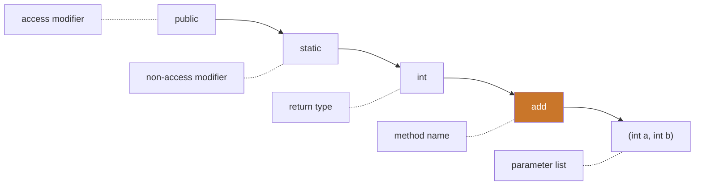
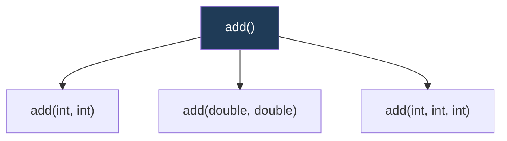

<div align="center">


  

</div>

---

> **In one line:** A method is a named block of logic that performs an action and optionally returns a value.

## 1. What Is It?

Methods are used to **perform actions**. Application business logic is written inside methods, and a class can have any number of them.

## 2. Method Signature



> The **method signature** is the method name plus its parameter list.

## 3. Syntax

```java
returnType methodName(parameters) {
    // logic
    return value;
}
```

## 4. Types Of Methods

| Type | Called using | Note |
|---|---|---|
| **Instance method** | `reference.method()` | Needs an object |
| **Static method** | `ClassName.method()` | No object required |
| **Abstract method** | Overridden in a subclass | Has no body |
| **Final method** | Normal call | Cannot be overridden |

## 5. Method Overloading

Two or more methods in the same class with the **same name but different parameter lists**.



Overloading can differ by **number**, **type** or **order** of parameters. A different **return type alone is not enough**.

## 6. Important Rules

- A method with return type `void` returns nothing.
- Values are passed **by value** in Java; for objects, the copied value is the reference.
- `main` is the special static method the JVM calls first.

## 7. Common Mistakes

- Trying to overload by changing only the return type.
- Calling an instance method directly from `main` without an object.

## 8. In Depth

A method call creates a stack frame holding the parameters, the local variables and the return address. When the method returns, that frame is discarded. Deep or unbounded recursion exhausts the stack and produces `StackOverflowError`, which is a different failure from `OutOfMemoryError` on the heap.

**Overload resolution happens at compile time** and follows a fixed order of preference: exact match, then widening primitive conversion, then autoboxing, then varargs. This ordering explains behaviour that looks arbitrary at first, such as `f(int)` being chosen over `f(Integer)` and `f(Object...)` being chosen last. Ambiguous calls that cannot be resolved by these rules are a compile error.

**Parameter passing is always by value.** For a primitive, the value is copied. For an object, the reference is copied, so the method can mutate the object but cannot redirect the caller's variable.

**Varargs** (`int... values`) is compiled into an array parameter, so a method cannot be overloaded with both `f(int[])` and `f(int...)`. A varargs parameter must be last.

Methods are also the natural unit of design. A method that does one thing, has a name describing that thing, and takes few parameters is far easier to test and reuse than a long method holding several responsibilities.

## 9. Quick Revision

> Method = modifier + return type + name + parameters + body. Overloading = same name, different parameter list.

---

<div align="center">

<a href="04-Variables.md">← Variables</a> &nbsp;•&nbsp; <a href="../README.md">Home</a> &nbsp;•&nbsp; <a href="06-Constructor.md">Constructor →</a>


<sub>Core Java Theory Notes • Maintained by <b>Kundan</b></sub>

</div>
