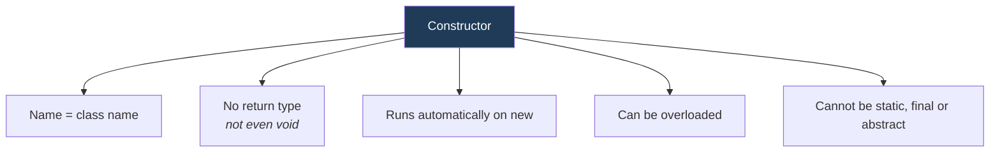
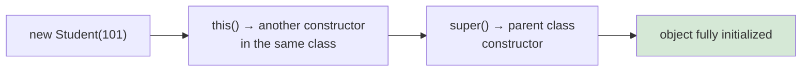

<div align="center">


  

</div>

---

> **In one line:** A constructor is a special block that initializes an object at the moment it is created.

## 1. What Is It?

A **constructor** is a special member used to **initialize an object**. It runs automatically when an object is created with `new`.

## 2. Rules At A Glance



## 3. Types Of Constructors

| Type | Description |
|---|---|
| **Default constructor** | Added by the compiler when no constructor is written; initializes fields to default values |
| **No-argument constructor** | Written by the developer with an empty parameter list |
| **Parameterized constructor** | Accepts values so each object starts with its own data |

## 4. Syntax

```java
class Student {
    int rollNo;

    Student() { }                       // no-arg
    Student(int rollNo) {               // parameterized
        this.rollNo = rollNo;
    }
}
```

## 5. Constructor Chaining



- `this()` calls another constructor of the **same** class.
- `super()` calls the **parent** class constructor.
- Either call must be the **first statement**, and only one of the two can appear.

## 6. Constructor vs Method

| | Constructor | Method |
|---|---|---|
| Name | Same as the class | Any valid identifier |
| Return type | None | Mandatory (`void` if nothing) |
| Invoked | Automatically on `new` | Explicitly by a call |
| Purpose | Initialize the object | Perform an action |
| Inherited | No | Yes |

## 7. Common Mistakes

- Writing `void` before a constructor, which turns it into an ordinary method.
- Expecting the default constructor to still exist after writing a parameterized one — it does not.

## 8. In Depth

A constructor is not a method, and the JVM treats it differently: it is compiled into a special member named `<init>`, it is never inherited and never overridden, and it is invoked only as part of object creation.

**The constructor chain always reaches `Object`.** If a constructor does not begin with an explicit `this(...)` or `super(...)`, the compiler inserts `super()` automatically. This means parent fields are fully initialised before the child constructor body runs — which is exactly why calling an overridable method from a constructor is dangerous: the overriding version runs while the subclass's own fields are still at their default values.

**The default constructor disappears once you write any constructor.** This breaks code that relied on `new Demo()` and is the reason many frameworks, which create objects reflectively, require an explicit no-argument constructor.

**`this(...)` for chaining.** Providing several constructors that all delegate to the most complete one keeps initialisation logic in a single place. Only one of `this(...)` or `super(...)` may appear, and it must be the first statement.

A **private constructor** is a deliberate design tool: it prevents external instantiation, and is how singletons, static utility classes and factory-only classes are built. When a class has many optional fields, a static factory method or the builder pattern usually communicates intent better than a long list of overloaded constructors.

## 9. Quick Revision

> Constructor = class name + no return type + runs on `new`. Default vanishes once you write your own.

---

<div align="center">

<a href="05-Methods.md">← Methods</a> &nbsp;•&nbsp; <a href="../README.md">Home</a> &nbsp;•&nbsp; <a href="../06-OOPS-Part-2/README.md">OOPS Part 2 →</a>


<sub>Core Java Theory Notes • Maintained by <b>Kundan</b></sub>

</div>
