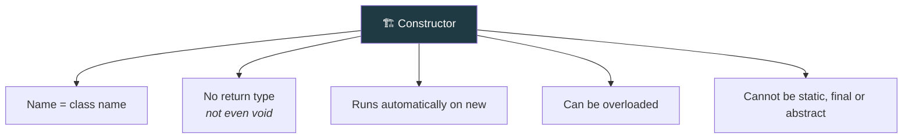
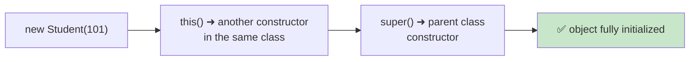

<div align="center">


  

</div>

---

> **In one line:** A constructor is a special block that initializes an object at the moment it is created.

## 🧠 1. What Is It?

A **constructor** is a special member used to **initialize an object**. It runs automatically when an object is created with `new`.

## 🧩 2. Rules At A Glance



## 📋 3. Types Of Constructors

| Type | Description |
|---|---|
| **Default constructor** | Added by the compiler when no constructor is written; initializes fields to default values |
| **No-argument constructor** | Written by the developer with an empty parameter list |
| **Parameterized constructor** | Accepts values so each object starts with its own data |

## 🧾 4. Syntax

```java
class Student {
    int rollNo;

    Student() { }                       // no-arg
    Student(int rollNo) {               // parameterized
        this.rollNo = rollNo;
    }
}
```

## 🔗 5. Constructor Chaining



- `this()` calls another constructor of the **same** class.
- `super()` calls the **parent** class constructor.
- Either call must be the **first statement**, and only one of the two can appear.

## ⚖️ 6. Constructor vs Method

| | Constructor | Method |
|---|---|---|
| Name | Same as the class | Any valid identifier |
| Return type | None | Mandatory (`void` if nothing) |
| Invoked | Automatically on `new` | Explicitly by a call |
| Purpose | Initialize the object | Perform an action |
| Inherited | ❌ No | ✅ Yes |

## ⚠️ 7. Common Mistakes

- Writing `void` before a constructor, which turns it into an ordinary method.
- Expecting the default constructor to still exist after writing a parameterized one — it does not.

## 🔁 8. Quick Revision

> Constructor = class name + no return type + runs on `new`. Default vanishes once you write your own.

---

<div align="center">

<a href="05-Methods.md">⬅️ Methods</a> &nbsp;•&nbsp; <a href="../README.md">🏠 Home</a> &nbsp;•&nbsp; <a href="../06-OOPS-Part-2/README.md">OOPS Part 2 ➡️</a>


<sub>📘 Core Java Theory Notes • Maintained by <b>Kundan</b></sub>

</div>
