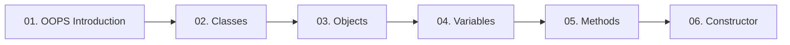

  

---

> The foundation of object oriented programming: classes, objects, the three kinds of variables, methods and constructors.

## Topics In This Chapter

| # | Topic | What you will learn |
|---|---|---|
| 01 | [OOPS Introduction](./01-OOPS-Introduction.md) | Why OOP replaced procedure oriented programming |
| 02 | [Classes](./02-Classes.md) | The blueprint that defines program elements |
| 03 | [Objects](./03-Objects.md) | Creating real instances from a class blueprint |
| 04 | [Variables](./04-Variables.md) | The three kinds of variables and their memory areas |
| 05 | [Methods](./05-Methods.md) | Writing, calling and overloading methods |
| 06 | [Constructor](./06-Constructor.md) | Initializing objects, default and parameterized constructors |

## Learning Path

---

<a href="../04-Arrays-and-Strings/README.md">← Command Line Arguments</a> &nbsp;•&nbsp; <a href="../README.md">Home</a> &nbsp;•&nbsp; <a href="../06-OOPS-Part-2/README.md">OOPS Part 2 →</a>

Core Java Theory Notes • Maintained by <b>Kundan</b>

