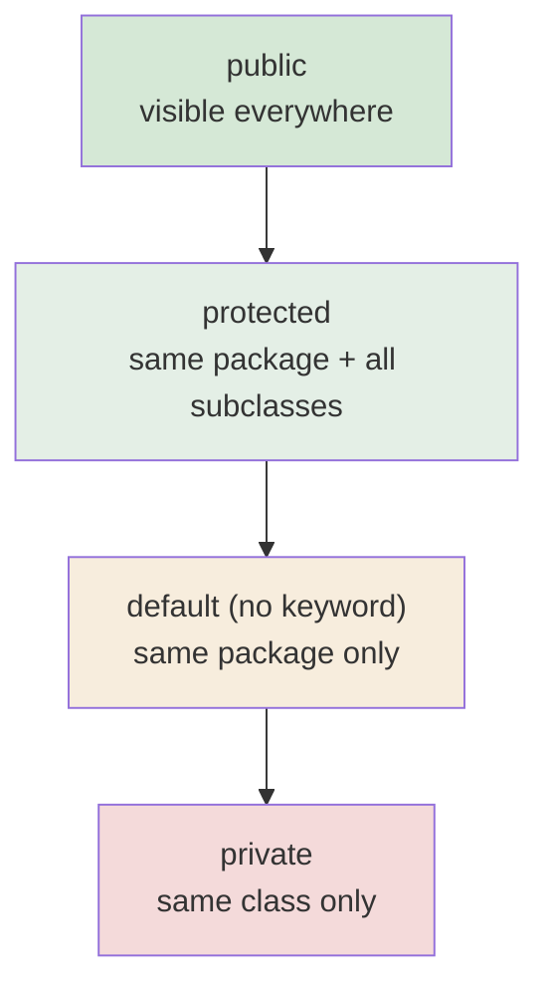

  

---

> **In one line:** Four keywords that decide who can see a class, variable, method or constructor.

## 1. What Is It?

Access modifiers are keywords used to **set accessibility**. An access modifier restricts the access of a class, constructor, data member or method from another class.

## 2. Visibility Scope

## 3. Access Matrix

| Access from | private | default | protected | public |
|---|---|---|---|---|
| Same class | Yes | Yes | Yes | Yes |
| Same package, other class | No | Yes | Yes | Yes |
| Subclass in another package | No | No | Yes | Yes |
| Non-subclass in another package | No | No | No | Yes |

## 4. Non-Access Modifiers

Java also supports many non-access modifiers: `static`, `final`, `abstract`, `synchronized`, `native`, `volatile`, `transient`, `strictfp`.

| Modifier | Effect |
|---|---|
| `static` | Belongs to the class, not to an object |
| `final` | Value, method or class cannot be changed, overridden or extended |
| `abstract` | No body; must be implemented by a subclass |
| `synchronized` | Only one thread at a time |
| `transient` | Skipped during serialization |
| `volatile` | Always read from main memory |

## 5. Important Rules

- A top-level class can only be `public` or **default**.
- `private` members are not inherited by subclasses.
- `protected` is the only modifier that crosses packages through inheritance.

## 6. In Depth

Access control is enforced by the compiler and verified again by the JVM, so it is a real boundary rather than a convention. Its purpose is to define a small, stable **public surface** for a class while leaving everything else free to change.

Two rules are easy to get wrong:

- **`protected` is broader than it looks.** It grants access to the whole package *and* to subclasses in other packages — but a subclass may only access the protected member through a reference of its own type, not through an arbitrary parent reference.
- **Access control is per class, not per object.** Code inside a class can read the private fields of *any* instance of the same class, which is what makes `equals()` implementations possible.

Modifier rules also depend on position. A top-level class may only be `public` or package-private; `private` and `protected` are legal only for members and for nested classes. Interface members are implicitly public, so a `private` method in an interface was impossible before Java 9.

**Non-access modifiers** answer different questions. `static` decides *what the member belongs to*; `final` decides *whether it can change*; `abstract` decides *whether it must be implemented elsewhere*; `synchronized` and `volatile` decide *how threads see it*; `transient` decides *whether it is serialised*. The modern module system adds a further layer, where `exports` in `module-info.java` controls whether a whole package is visible outside its module at all.

## 7. Quick Revision

> private → class • default → package • protected → package + subclasses • public → everywhere.

---

<a href="../05-OOPS-Part-1/06-Constructor.md">← Constructor</a> &nbsp;•&nbsp; <a href="../README.md">Home</a> &nbsp;•&nbsp; <a href="02-Encapsulation.md">Encapsulation →</a>

Core Java Theory Notes • Maintained by <b>Kundan</b>

