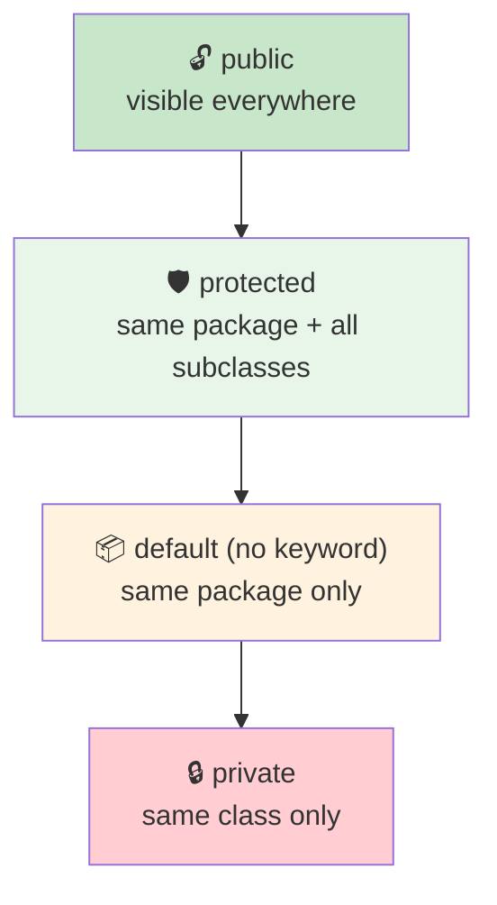

  

---

> **In one line:** Four keywords that decide who can see a class, variable, method or constructor.

## 🧠 1. What Is It?

Access modifiers are keywords used to **set accessibility**. An access modifier restricts the access of a class, constructor, data member or method from another class.

## 🧩 2. Visibility Scope

## 📋 3. Access Matrix

| Access from | private | default | protected | public |
|---|---|---|---|---|
| Same class | ✅ | ✅ | ✅ | ✅ |
| Same package, other class | ❌ | ✅ | ✅ | ✅ |
| Subclass in another package | ❌ | ❌ | ✅ | ✅ |
| Non-subclass in another package | ❌ | ❌ | ❌ | ✅ |

## 🧰 4. Non-Access Modifiers

Java also supports many non-access modifiers: `static`, `final`, `abstract`, `synchronized`, `native`, `volatile`, `transient`, `strictfp`.

| Modifier | Effect |
|---|---|
| `static` | Belongs to the class, not to an object |
| `final` | Value, method or class cannot be changed, overridden or extended |
| `abstract` | No body; must be implemented by a subclass |
| `synchronized` | Only one thread at a time |
| `transient` | Skipped during serialization |
| `volatile` | Always read from main memory |

## 📌 5. Important Rules

- A top-level class can only be `public` or **default**.
- `private` members are not inherited by subclasses.
- `protected` is the only modifier that crosses packages through inheritance.

## 🔁 6. Quick Revision

> private ➜ class • default ➜ package • protected ➜ package + subclasses • public ➜ everywhere.

---

<a href="../05-OOPS-Part-1/06-Constructor.md">⬅️ Constructor</a> &nbsp;•&nbsp; <a href="../README.md">🏠 Home</a> &nbsp;•&nbsp; <a href="02-Encapsulation.md">Encapsulation ➡️</a>

📘 Core Java Theory Notes • Maintained by <b>Kundan</b>

